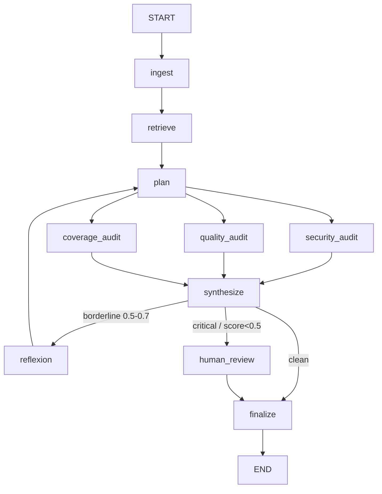

# LangGraph PR Audit Agent 🏦🔒

A multi-agent stateful AI system designed to automate Pull Request (PR) security and quality audits, built for comprehensive security assessments across all domains.

## 📖 What is this project?
In modern software development, every code change requires strict security reviews before merging to prevent vulnerabilities and data leaks. 

This project uses **LangGraph** to orchestrate a team of specialized AI agents that review GitHub PR diffs. It utilizes the **ReAct** (Reason + Act) pattern to deeply analyze code changes against strict security standards (OWASP Top 10, SQL Injection, PII data leaks, Authentication bypasses).

### Core Technologies:
- **LangGraph:** Stateful multi-agent orchestration and routing.
- **Gemini 2.5 Flash (audits) + Gemini 2.5 Pro (reflexion):** Core LLM reasoning engine (via `google-genai`).
- **Instructor:** Enforces strict structured JSON outputs (Pydantic V2 schemas).
- **Python 3.12+:** Core language.

---

## 🏗️ Architecture



**Routing rules** (precedence: human review > reflect > finalize)
- `should_reflect`: **any** of the three scores (security/quality/test) in [0.5, 0.7], OR an auth-related file changed with zero **security** findings ("suspicious silence" - security-only heuristic). Capped at 2 loops (`iteration_count` guard).

- `needs_human_review`: any CRITICAL finding (any dimension), or **any** score < 0.5. Graph pauses here (`interrupt_before`).


### How the pipeline works
1. **Ingest** parses the raw diff into added/removed lines + a `files_changed` list.
2. **Plan** (`gemini-2.5-flash`) triages the diff once - produces an `AuditPlan` (focus areas, risk level, audit depth). This is **Plan-Execute**: the three audits each receive a *targeted* brief instead of re-reading the whole diff cold.
3. **Three audits run in parallel** - security (OWASP/SQLi/PII/authn), quality (smells, magic numbers, DRY/SOLID), and coverage (missing tests). All are **plan-aware** (they read `audit_plan.focus_areas`).
4. **Synthesize** computes deterministic, severity-weighted scores ($0, no LLM) the router can act on.
5. **Reflexion** (`gemini-2.5-pro`) - on a borderline result, a *smarter* model critiques the audit, identifies gaps, and loops back to plan for a sharper second pass (max 2 loops).
6. **Human review / finalize** - escalate on critical findings, otherwise finalize.

---

## 🚀 How to Install & Start

### 1. Clone & Environment Setup
```bash
# Clone the repository
git clone <your-repo-link>
cd langgraph-pr-audit-agent

# Create and activate a virtual environment (Windows)
python -m venv venv
venv\Scripts\activate
```

### 2. Install Dependencies
```bash
pip install -r requirements.txt
```

### 3. Environment Variables
Copy `.env.template` file to `.env` file in the root directory and add your API keys:
```bash
# bash and powershell
cp .env.template .env

# windows command prompt (cmd)
copy .env.template .env
```

---

## 🧪 How to Test

### Run the Unit Tests (Pytest)
Unit tests run instantly and cost $0, asserting that your deterministic logic (like diff parsing) works perfectly.
```bash
# Run tests with verbose output
pytest -v

# Fast, $0 unit tests (mocked LLM) - excludes live integration tests
pytest -m "not integration" -v
```

### Run the E2E Smoke Test
The smoke tests push sample PR diffs through the entire LangGraph state machine with **live** Gemini calls. Two scenarios are included:
- **SQL-injection diff** → high-risk path: escalates and pauses at `human_review`.
- **Borderline diff** (mediocre code, no critical issues) → triggers the **reflexion** self-critique loop.

```bash
# Run the full graph smoke tests
python main.py --test
```