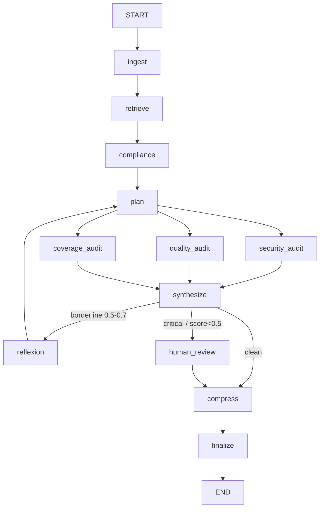
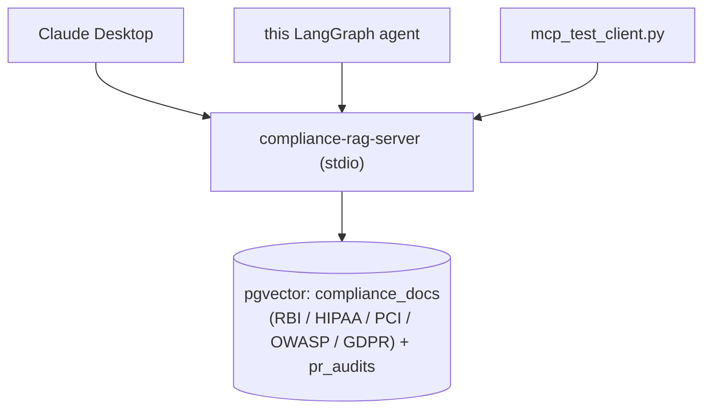

# LangGraph PR Audit Agent

A multi-agent, stateful AI system that automates Pull Request security and quality audits. Built for regulated codebases: every change touching payment logic, customer PII or auth gets reviewed before merge.

## What is this project?
In a regulated codebase, a code change that touches auth or payment paths needs a security review before it merges. This agent does that review automatically.

It uses **LangGraph** to orchestrate a team of specialized agents over a GitHub PR diff, applying the **ReAct** (Reason + Act) pattern to check changes against OWASP Top 10, SQL injection, PII leaks and authentication bypasses.

### Core Technologies

**Orchestration & language**
- **LangGraph:** Stateful multi-agent orchestration and routing (the graph runs on a nested `AMSState`).
- **Python 3.12+ / asyncio:** The three audits are `async` nodes that run **concurrently** - their Gemini calls overlap on worker threads (`asyncio.to_thread`) instead of running in series.

**LLM & structured output**
- **Gemini 2.5 Flash + Gemini 2.5 Pro (via `google-genai`):** Flash drives the triage/quality/coverage/compliance work; Pro the deeper reasoning (reflexion and the security audit's cache path). Nodes pick by *tier*, not by name - see below.
- **Model-tier router + context caching:** One router (`UnifiedLLMClient`) maps a tier to a model and keeps the retry/rotation/fail-closed contract; the shared diff is cached once per audit and reused across the Flash nodes (~74% input-cost cut on a large diff, verified live). See [Model tiers & context caching](#model-tiers--context-caching).
- **Instructor:** Enforces strict structured outputs (Pydantic V2 schemas) - no hand-rolled JSON parsing.

**Memory & retrieval** - see [Agent Memory](#agent-memory-four-types-one-system)
- **pgvector (Postgres 16, Docker):** Backs the four-type agent memory (HNSW, cosine > 0.7).
- **Gemini Embeddings (`gemini-embedding-001`, 768-dim):** Embeds diffs (semantic/episodic recall) and proposed rules (near-duplicate detection in [rule governance](#rule-governance-reviewing-what-the-agent-proposes)).
- **Context management:** A [`TokenBudgetManager`](#context-budgeting-tokenbudgetmanager) (priority-ordered, never silent) and an in-graph [history-compression node](#history-compression-the-compress-node) for long sessions.

**Compliance grounding (MCP)** - see [Compliance grounding](#compliance-grounding-over-mcp)
- **Model Context Protocol (`mcp`, `langchain-mcp-adapters`):** The agent is both an MCP **client** (it consumes tools over stdio) and an MCP **server** (`compliance-rag`) that any MCP client - Claude Desktop, a raw-SDK client - can call with zero glue.
- **Multi-framework rule packs (`packs/*.yaml`):** Pluggable regulatory corpora (RBI, HIPAA, PCI-DSS, OWASP, GDPR) - adding a framework is dropping a YAML file, no code change. A finding cites the exact clause it breaks.

**Reliability** - see [Reliability](#reliability-fail-closed)
- **Resilience layer (`src/llm_retry.py`, `tenacity`):** Centralized retry / server-directed backoff / multi-key rotation across every Gemini call, **thread-safe** under the concurrent fan-out, with fail-closed semantics. Classifies a 429 by its cause - per-minute throttle (wait the server's stated delay), per-day quota or depleted billing credits (rotate keys), blocked key (rotate immediately) - never one blunt retry policy.

**Observability & ops**
- **LangSmith:** Tracing + custom output-quality evaluators.
- **GitHub Actions:** A free test job on every PR plus an opt-in [pre-merge audit gate](#continuous-integration-audit-on-every-pr) that blocks merge on an unaddressed critical finding.

---

## Architecture



**Routing rules** (precedence: human review > reflect > finalize)
- `should_reflect`: **any** of the three scores (security/quality/test) in [0.5, 0.7], OR an auth-related file changed with zero **security** findings ("suspicious silence" - security-only heuristic). Capped at 2 loops (`iteration_count` guard).

- `needs_human_review`: any CRITICAL finding (any dimension) or **any** score < 0.5. Graph pauses here (`interrupt_before`).


### How the pipeline works
1. **Ingest** parses the raw diff into added/removed lines + a `files_changed` list.
2. **Retrieve** embeds the diff (`gemini-embedding-001`) and queries pgvector for similar past audits (cosine > 0.7), feeding precedent into the plan. Degrades gracefully if the DB is unavailable.
3. **Compliance** (`gemini-2.5-flash`) triages whether the diff is regulated and, if so, pulls matching regulatory passages from the multi-framework corpus over MCP (see [Compliance grounding](#compliance-grounding-over-mcp)). An unregulated diff (docs, typos, tests) short-circuits with no lookup and no wasted call. The passages are carried forward so the security audit can cite the clause a finding breaks.
4. **Plan** (`gemini-2.5-flash`) triages the diff once - produces an `AuditPlan` (focus areas, risk level, audit depth). This is **Plan-Execute**: the three audits each receive a *targeted* brief instead of re-reading the whole diff cold.
5. **Three audits run concurrently** - security (OWASP/SQLi/PII/authn), quality (smells, magic numbers, DRY/SOLID) and coverage (missing tests). They are `async` nodes whose Gemini calls overlap (the blocking client runs on a worker thread via `asyncio.to_thread`), so the three LLM round-trips happen at once rather than in series - real concurrency, not just LangGraph's structural fan-out. All are **plan-aware** (they read `audit_plan.focus_areas`).
6. **Synthesize** computes deterministic, severity-weighted scores ($0, no LLM) the router can act on.
7. **Reflexion** (`gemini-2.5-pro`) - on a borderline result, a *smarter* model critiques the audit, identifies gaps and loops back to plan for a sharper second pass (max 2 loops).
8. **Human review** - on a CRITICAL finding or score < 0.5, the graph **pauses** at `human_review` (`interrupt_before`) for a human decision (see [Human-in-the-Loop](#human-in-the-loop-pause--inject--resume)); otherwise it skips straight on.
9. **Compress** - both paths into finalize funnel through a `compress` node that compacts the oldest portion of the session history when it has grown large (or when forced); a no-op pass-through otherwise (see [History compression](#history-compression-the-compress-node)).
10. **Finalize** - assembles the markdown report and persists it to pgvector as precedent (and, when compression fired, stores the *compacted* history as the session episode).

### Compliance grounding over MCP
A finding is more useful when it cites the rule it breaks. The agent grounds its security findings in a real regulatory corpus, served and consumed over the **Model Context Protocol (MCP)**.

The corpus is pluggable. Frameworks live in `packs/*.yaml` data files; RBI, HIPAA (healthcare), PCI-DSS (cards), OWASP (app security) and GDPR (privacy) ship by default. Adding one is dropping a YAML file and re-running the idempotent seeder - no code change. The split that makes this work: `category` (security/quality/coverage, what the engine reasons over) is a typed enum with a DB `CHECK`, while `framework` is a free-form indexed tag, the axis the world keeps extending. The core stays small; the corpus stays open.

The agent is on both ends of the protocol. As a *client*, the `compliance` node connects via `MultiServerMCPClient` and calls `search_compliance_docs` over stdio. It fails soft - if the server can't start, or the diff isn't regulated, the audit carries on with empty context and a visible trace line instead of crashing or quietly reporting "clean". As a *server*, `src/mcp/compliance_rag_server.py` (`FastMCP`) exposes that same retrieval as a tool whose `@mcp.tool()` docstring *is* the schema the calling model reads. Anything that speaks MCP - Claude Desktop, a raw-SDK client - can call it with no glue, because the tool is a protocol endpoint rather than a Python import trapped in this process.

When the diff is regulated, the retrieved passages go into the security-audit prompt and the model cites the clause directly. A planted SQL-injection diff produces a finding with a `Citations:` block quoting the *RBI Cyber Security Framework* and *OWASP A03:2021 - Injection*. On an unregulated diff the injection is empty, so there's no token cost when there's no rule to cite.

For the audit trail, an in-prompt citation isn't enough - a model can paraphrase or invent a clause. So the report carries a separate **Compliance audit trail**: the agent asks the model to quote each span verbatim, then verifies that span is a real substring of the passage it names and **drops any that isn't** - the substring check is the trust boundary, so every rendered span is a guaranteed-verbatim quote. It runs on the same Gemini spine (`src/citations.py`, `gemini-2.5-flash`), no second provider. The result is a per-claim blockquote in the report:

```markdown
### Compliance audit trail
- Logs PII without masking.
  > "Sensitive customer data: PII must be masked in logs." -- RBI
```

A clean diff renders no section - the absence of a citation is never dressed up as a clean bill of health.

```bash
docker compose up -d
python -m src.db.vectorstore        # creates the compliance_docs table + HNSW index
python -m scripts.seed_compliance   # loads every packs/*.yaml (idempotent)
```

### Reliability (fail-closed)
Every Gemini call routes through `src/llm_retry.py`, which:
- Backs off on per-minute 429s **server-directed first**: it waits the delay the server asks
  for (`retryDelay`) when present and only falls back to exponential backoff
  (`wait_exponential(min=1, max=30)`, capped at 90s) when it doesn't - so the client never
  guesses a wait the server already specified. On per-day quota or a blocked key it instead
  **rotates** `GEMINI_API_KEY → KEY2 → KEY3 → KEY4`.
- Raises `QuotaExhaustedError` only when **all** keys are unusable - the graph then aborts
  and emits **no report** rather than a misleading "all clear".
- **Rotation is concurrency-safe.** The three parallel audits can hit a dead key at the same
  instant; a `threading.Lock` with a double-checked rotation in the retry layer stops them
  from skipping past good keys (see [DESIGN.md](DESIGN.md) for the mechanism).
- If an audit node degrades (transient API error), it records to `node_errors`; `synthesize`
  forces all scores to `0.0` when an audit actually failed, so a transport failure can never
  masquerade as a clean PR. **A failure is never a false pass.**

---

## Model tiers & context caching

Every node selects its model by **tier**, not by a hard-coded name, through one router
(`UnifiedLLMClient` in `src/llm_client.py`):

| Tier | Model | Used for |
|------|-------|----------|
| `fast` | Gemini 2.5 Flash-Lite | the cheapest path / fallback floor |
| `balanced` | Gemini 2.5 Flash | triage, plan, the quality/coverage audits, compliance |
| `powerful` | Gemini 2.5 Pro | reflexion and the security audit's cache path |
| `cite` | Gemini 2.5 Flash | the verbatim-citation extraction |

A tier that isn't pinned falls back down the chain (`balanced → fast`) on an exhausted model. The
router sits on the same retry/rotation spine, records which tier actually served each call, and on a
total quota exhaustion re-raises `QuotaExhaustedError` as itself so the fail-closed contract survives
the abstraction. Sequential nodes call `llm.call(...)` (sync); the parallel fan-out calls
`llm.acall(...)` (async) - same tier table, same fallback, the split is only about the event loop.

The model names themselves, the token ceilings, the score thresholds and every other tunable live in
one place - `src/config.py` - imported as `cfg` wherever they're read, so the tier table composes its
models from config rather than hard-coding strings. Changing a model is a one-line edit there, and
nothing downstream drifts.

### Caching the diff (per-PR)

In one audit the **same diff** is sent by several Flash nodes - compliance, plan, quality and
coverage - while each node's *instructions* differ. So the diff is registered **once** as a Gemini
`CachedContent` and reused across those nodes; each one sends only its own instructions fresh.
**`compliance` runs first and primes the handle**, so the parallel quality/coverage calls are pure
reusers - there's no create-race. The four share one handle because they share one model (a
`CachedContent` is model-bound).

There's a floor on when this is worth it. A repeat read is billed at ~25% of the input rate, so the
saving scales with how many tokens get *reused*, and Gemini rejects any cache under **2,048 tokens**.
Below that the node just falls back to a plain Flash call - no cache, no penalty and the caller
never has to branch. The diff clears the floor on large PRs, which is exactly where you want the
saving. Measured on a 3,000-token diff at the published Flash rate ($0.30/1M input, cached
reads at 25%), reusing the diff cut the **input cost ~74%** on each reusing node - the ratio is rate-
independent because a cache read is billed at 25% of the input rate either way. Verified live via
`cached_content_token_count > 0` on the repeat call - the claim is never made without that field
proving the cache actually engaged.

### Caching the prefix (cross-PR, for batch)

The security audit takes this path **only on a regulated diff** - when the compliance node found
matching passages, it runs on Pro (`tier="powerful"`) and caches its stable system **prefix**
(instructions + rules + compliance), which is byte-identical across *different* PRs of the same corpus.
That's the cross-PR optimization - it pays when many PRs are audited inside the 5-minute cache window
(batch runs, a busy review queue), not on a single audit. On its Pro path security can't share the
Flash diff-handle regardless, since a `CachedContent` is model-bound. An *unregulated* diff has no
compliance context, so the security audit skips this path and runs on plain Flash like the other audit
nodes. Today the prefix is usually under the 2,048-token floor too, so even the regulated path falls
back to a plain Flash call until the rule/compliance corpus grows past it - a deliberate, documented
forward-looking path rather than a live saving.

### Tool-choice modes (forcing a call vs letting the model decide)

When a node offers the model a tool, Gemini's `FunctionCallingConfig.mode` controls *whether* the model
is allowed to skip the call. The choice is not cosmetic - it changes the output-token cost:

| Mode | `mode` / `allowed_function_names` | Behaviour |
|------|----------------------------------|-----------|
| **auto** | `AUTO` | the model decides whether to call - it spends tokens reasoning "should I call a tool?" |
| **any** | `ANY` | the model **must** call at least one tool, but still chooses which |
| **tool** | `ANY` + one allowed name | **forced extraction** - the model emits that one call's arguments with no decision preamble |
| **parallel** | `AUTO`, two tools offered | the model may emit **both** calls in one turn (one round-trip instead of two) |

`scripts/tool_choice_bench.py` measures all four on a fixed diff so the token deltas are real numbers,
not a claim. Forcing a specific tool (`tool`) is the cheapest: it skips both the "should I?" and the
"which one?" reasoning. `parallel` is the latency win - a diff that needs two lookups does one
round-trip rather than two.

```bash
python -m scripts.tool_choice_bench   # live; prints inTok / outTok / #calls per mode
```

The audit applies this lesson without a rewrite. The forced-extraction case is exactly the
compliance/plan/audit nodes' structured output, and **Instructor already forces it** on the Gemini
spine: a `response_model` makes the call mandatory *and* retries on a validation failure, which is
strictly stronger than raw `tool_config`. So Instructor stays the path for the pydantic schemas; the
benchmark is the measured evidence for why, and the `parallel` insight is held for the case where a
single diff genuinely needs both MCP tools in one turn.

---

## Agent Memory (four types, one system)

The agent doesn't just react to the PR in front of it - it remembers. Memory is organised as four
types under one entry point, `AgentMemorySystem` (`src/memory.py`), borrowing the standard
cognitive split so each kind of memory has a clear job:

| Type | Holds | Where it lives | Retrieved by |
|------|-------|----------------|--------------|
| **In-context** | The live run's working state (diff, findings, scores) | `AuditState`, in the graph | direct read |
| **Semantic** | Similar past PR audits (precedent) | `pr_audits` (pgvector) | cosine similarity |
| **Episodic** | Compressed past-session summaries | `session_episodes` (pgvector) | cosine similarity |
| **Procedural** | Org audit rules / templates, keyed by category | `procedural_rules` (Postgres) | exact category lookup |

> A run also carries a transient `compressed` channel - the compacted history produced by the
> `compress` node, which `finalize` promotes into the episodic store. See
> [History compression](#history-compression-the-compress-node).

**Persistent locally, ephemeral in CI.** The three persistent types live in Postgres. Locally the
Docker pgvector container holds data across runs, so recall accumulates. In GitHub Actions the
[pre-merge gate](#continuous-integration-audit-on-every-pr) uses a fresh pgvector service container
per run, so a CI audit starts from an empty store and degrades gracefully (it never depends on
history).

The graph runs on a nested `AMSState`: an `audit` substate (the in-context `AuditState`) plus
`semantic` / `episodic` / `procedural` channels as siblings, with a custom `merge_audit` reducer so
the parallel audit fan-out doesn't clobber the substate. Embeddings are memoised per process
(bounded LRU) so a diff embedded by several nodes costs one API call.

Memory is recalled once per run (in `retrieve`) into the shared channels, then consumed where useful:

- **Semantic + episodic** precedent flows into the **plan** node, which uses "have we seen a change
  like this before?" to steer triage (focus areas, audit depth).
- **Procedural** rules are injected **verbatim** into each audit node's prompt, per domain - the
  security auditor sees the security rules, quality sees quality rules, coverage sees coverage rules.

### Rules have a lifecycle (and the agent can propose its own)

Procedural rules carry a `status` so the system can tell a trusted policy from an unvetted
suggestion:

| Status | Origin | Injected into audits? |
|--------|--------|------------------------|
| `seeded` | Human-authored baseline policy | Yes - active immediately |
| `learned_pending` | Proposed by the agent from its own findings | **No** - awaiting human review |
| `learned_approved` | A human approved a pending rule | Yes |
| `rejected` | A human rejected a proposed rule | No - kept so it is not re-proposed |
| `retired` | A human deactivated a once-active rule | No - kept so it is not re-learned |

After an audit, the agent promotes its strongest findings (critical/high only, deduplicated) into
**proposed** rules - but they land as `learned_pending` and are **never enforced until a human
approves them**. This is deliberate: a rule derived from the agent's own output is a feedback loop,
and a single false positive would otherwise become a permanent rule injected into every future
audit. So the agent *proposes*; a human *approves*. Only `seeded` and `learned_approved` rules ever
reach a prompt.

Each proposed rule also records the **human's verdict on the PR it was learned from**
(`source_decision`). That verdict **gates** learning: a PR the human sent back (`needs-changes`) or
turned down (`reject`) proposes **no** rules at all - findings on code that is being revised or
abandoned should not become standing rules. Only an approved PR (or one that never needed review)
proposes rules, and even then they sit `learned_pending` until a human approves them. The PR's
audit record and episode are still stored on every verdict (a deferral is honest precedent); only
the rule *learning* is suppressed.

---

## Rule governance (reviewing what the agent proposes)

Proposed rules sit inactive until a human approves them, in a standalone terminal tool (rule
governance is out-of-band store maintenance, separate from an audit run):

```bash
python -m scripts.review_rules
```

It runs in two phases:

**1. Review proposed rules** (`learned_pending`). For each one it shows the rule, the verdict on the
PR it was learned from and any near-duplicate existing rules (by cosine similarity) so you can catch
reworded re-learns. You answer per rule:

| Key | Action | Effect |
|-----|--------|--------|
| `a` | **approve** | `learned_pending → learned_approved` - the rule is now **active** and injected into future audits |
| `r` | **reject** | `learned_pending → rejected` - kept in the store (so the agent will not re-propose it), never injected |
| `s` | **skip** | left as `learned_pending` for a later review |

**2. Manage active rules** (`seeded` + `learned_approved`). Lists each with its id, then accepts:

| Command | Action | Effect |
|---------|--------|--------|
| `retire <id>` | **deactivate** | stops injecting the rule but keeps the row, so a learned rule is not silently re-learned next run (the un-learn-safe off switch) |
| `delete <id>` | **hard-remove** | deletes the row entirely; for a *learned* rule the tool warns first, because the same finding will be re-proposed on the next matching audit |
| `done` | finish | exit the tool |

> Approval is per rule (no bulk "approve all"), since each becomes a standing policy enforced verbatim
> on every future PR. Seed *trusted* baseline policy directly via `scripts/seed_rules.py` (written as
> `seeded` - active immediately, no review). The similarity hint is advisory only (untuned threshold);
> the human approval gate is the real deduplicator.

---

## MCP integration

The audit's external tools are exposed and consumed over the Model Context Protocol rather than as
in-process Python wrappers. That one decision is what makes the compliance RAG reusable by anything
that speaks MCP.

**As a client.** The agent connects to the compliance-rag server below via `MultiServerMCPClient`.
A `compliance` node runs
between retrieval and planning: it triages whether a diff touches regulated concerns (personal data,
payment-card data, health data, auth, money movement, audit logging) and, if so, calls
`search_compliance_docs` to ground the audit in the actual regulatory clauses before the plan is
drawn up. A diff that isn't regulated skips the lookup entirely - no wasted call.

**Multi-framework, plug-and-play.** The compliance corpus is not tied to one industry. Each
regulation is a rule pack - a `packs/<framework>.yaml` data file - loaded into the store at seed
time. RBI, HIPAA (healthcare), PCI-DSS (payments), OWASP (application security), and
GDPR/DPDP (privacy) ship by default; adding another (SOX, FedRAMP, ...) is dropping a YAML file, no
code change. `category` (security/quality/coverage) is a typed enum the engine reasons over;
`framework` is an open tag, so contributors extend the breadth without touching the core.

**As a server.** `compliance-rag-server` (`src/mcp/compliance_rag_server.py`) exposes two tools
over stdio - `search_compliance_docs` (multi-framework passage search, with an optional `framework`
filter) and `get_pr_audit_history` (similar past audits). Because it speaks MCP, ANY MCP-compatible
client can use it: Claude Desktop, another LangGraph agent or the included
`scripts/mcp_test_client.py`. The compliance RAG is shared infrastructure any of them can reach,
instead of a function locked inside one process.



**Why MCP over a custom tool.** A custom tool lives and dies inside one Python process; an MCP tool
is a typed protocol endpoint any agent can reuse. The cost is one subprocess hop; the benefit is the
compliance RAG becomes a shared capability instead of a private function.

### Verifying the server over stdio

`scripts/mcp_test_client.py` is a standalone client (raw `mcp` SDK, no LangChain) that spawns the
server as a subprocess and drives the full `initialize -> list_tools -> call_tool` handshake - the
same wire protocol Claude Desktop uses. If it lists both tools and returns passages, the server is
genuinely spec-compliant, not just compatible with one adapter:

    python -m scripts.seed_compliance     # ensure the corpus exists
    python -m scripts.mcp_test_client     # talk to the server over stdio

    Tools exposed by compliance-rag-server:
      - search_compliance_docs : search regulatory passages across frameworks (optional framework filter)
      - get_pr_audit_history   : retrieve similar past PR audits

    search_compliance_docs('PII logging', k=3)  [all frameworks]:
       [gdpr] Personal data must not be written to application logs in identifiable form ...
       [pci_dss] PAN must be rendered unreadable; logging of full PAN is prohibited ...
       [rbi] Sensitive customer data in logs must be masked per the Cyber Security Framework ...

    search_compliance_docs('PHI in logs', k=2, framework='hipaa')  [one pack]:
       [hipaa] PHI written to logs is a disclosure; logs containing PHI fall under the Security Rule ...
       [hipaa] Audit controls must record access to ePHI without exposing the ePHI itself ...

The cross-framework call returns passages from several packs; the filtered call returns HIPAA-only -
proving the `framework` parameter works over the wire, not just in-process.

**Seeing what the server is doing.** The server logs each tool call (the query and how many passages
came back from which frameworks) to `stderr` - never `stdout`, which carries the JSON-RPC protocol the
client parses. Logging is off by default; set `MCP_DEBUG=1` to turn it on:

    MCP_DEBUG=1 python -m scripts.mcp_test_client

The log lines appear in your terminal interleaved with the client output (under Claude Desktop they go
to its MCP log files instead). This is the quick way to see *why* a call came back empty - an empty
corpus, a `framework` filter that matched nothing or a similarity threshold that cut every hit.

### Connecting Claude Desktop to the compliance server

Add to your Claude Desktop MCP config (`claude_desktop_config.json`):

    {
      "mcpServers": {
        "compliance-rag": {
          "command": "python",
          "args": ["-m", "src.mcp.compliance_rag_server"],
          "cwd": "/absolute/path/to/langgraph-pr-audit-agent"
        }
      }
    }

Then `search_compliance_docs` and `get_pr_audit_history` appear as tools in Claude Desktop.

---

## History compression (the `compress` node)

A long-running session accumulates messages - plan, three audit results, reflexion passes, the
human decision. Left unbounded, that history grows toward the model's context limit. The `compress`
node folds the **oldest ~50%** of the message history into a single summary that preserves the
signal (decisions, scores, CRITICAL/HIGH findings, file paths) and discards exploratory chatter,
keeping the newest messages verbatim.

Both paths into `finalize` (the clean path and the post-`human_review` path) route through
`compress`, so finalize always sees a consistent state. When compression doesn't fire, the node is a
**pass-through** and a normal short audit pays nothing for it.

**Two triggers (an OR gate):**

| Trigger | Source | Meaning |
|---------|--------|---------|
| **auto** | `should_compress` at 80% of a token budget | the session genuinely approached the limit |
| **force** | the `--large` flag, threaded into state as `force_compress` | compress regardless of size (demo / explicit) |

The compacted history is written to its own `compressed` channel (the working transcript is
append-only, so compression can't overwrite it). `finalize` stores it as the session **episode** when
present, falling back to a structured findings summary otherwise - so a compressed session this run
becomes precedent a future run can recall. If the summariser model (`gemini-2.5-flash`) is
unavailable, a no-LLM fallback keeps only the signal lines (decision/plan/findings) so compression
never loses important content; `QuotaExhaustedError` propagates (fail-closed, like the audit nodes).

---

## Context budgeting (`TokenBudgetManager`)

When you assemble a prompt from several pieces - a system prompt, the diff, retrieved precedent,
chat history - and the total can outgrow the model's window, you need to decide *what to drop* in
priority order rather than letting the call fail or truncate at a random byte. `TokenBudgetManager`
(`src/token_budget.py`) does that and **logs every trim** so nothing is ever dropped silently.

It is generic by design: it imports nothing from this app (no `AuditState`, no DB). It operates on a
plain list of labelled, prioritised text `Segment`s and a budget and returns the segments that fit
plus a trim log. The caller is what knows about your state - the manager just honours the priorities
you assign.

```python
from src.token_budget import TokenBudgetManager, Segment

# priority: lower number = higher priority. 0 = mandatory (never trimmed).
segments = [
    Segment(0, "system",     system_prompt),    # always kept
    Segment(1, "query",      user_diff),         # the current change
    Segment(2, "chunk:auth", retrieved_chunk),   # retrieved context, droppable
    Segment(3, "history:0",  old_message),       # oldest history, dropped first
]

kept, trim_log = TokenBudgetManager(budget_tokens=8000).fit(segments)

prompt = assemble(kept)          # build your prompt from what survived
for line in trim_log:            # never silent: surface what was dropped and why
    print(line)
```

**Priority convention:** `0` = system prompt (mandatory) · `1` = query / current diff · `2` =
retrieved chunks by relevance · `3+` = history. To trim **oldest history first**, give older
messages a higher priority number (e.g. `3 + age`) - the manager sorts by `(priority, input order)`,
so a naive all-equal priority would trim the *newest* first, which is the wrong end.

**Swapping the token counter:** the estimate is a dependency-free `len(text) // 4` heuristic - fine
for *deciding what to drop* (it doesn't need to be exact). The `counter` parameter lets you plug in a
real tokenizer when you want precision:

```python
TokenBudgetManager(budget_tokens=8000, counter=my_real_tokenizer)
```

The budget manager is **not** wired into the live audit (a single PR diff is far below the model
window, so it would trim nothing). It is built and tested under synthetic load in
`tests/test_token_budget.py`, ready to drop in for genuinely large diffs - see
[DESIGN.md](DESIGN.md#handling-very-large-1m-token-pr-diffs) for how to extend the pipeline to
handle 1M+ token inputs.

---

## How to Install & Start

### 1. Clone & Environment Setup
```bash
# Clone the repository
git clone <your-repo-link>
cd langgraph-pr-audit-agent

# Create and activate a virtual environment (Windows)
python -m venv venv
venv\Scripts\activate
```

### 2. Install Dependencies
```bash
pip install -r requirements.txt
```

### 3. Environment Variables
Copy `.env.template` file to `.env` file in the root directory and add your API keys:
```bash
# bash and powershell
cp .env.template .env

# windows command prompt (cmd)
copy .env.template .env
```

### 4. Start the vector store (Docker)
The agent persists each audit to pgvector so future similar PRs can retrieve precedent.
```bash
docker compose up -d              # starts pgvector/pgvector:pg16 on $POSTGRES_PORT
python -m src.db.vectorstore      # create the tables + HNSW index (idempotent, safe to re-run)
python -m scripts.seed_rules      # load baseline org rules (idempotent; re-run adds only new ones)
```
`docker compose up -d` only starts an empty Postgres. The second command creates the
`vector` extension and the four tables the agent reads/writes (the three memory tables -
`pr_audits`, `session_episodes`, `procedural_rules` - plus `compliance_docs` for the MCP
corpus). It is idempotent
(`CREATE TABLE IF NOT EXISTS`), so re-running it is harmless. The third loads the baseline
org rules the audit enforces - without it the procedural-rules table is empty and that check
is a no-op. It dedups, so editing the rule list and re-running only inserts what's new.

---

## In case you have to NUKE the schema
> **Destructive - read before running.** This permanently deletes all stored
> audits, session episodes and rules. Only use it when you want a clean slate
> (e.g. after a schema change that `CREATE TABLE IF NOT EXISTS` can't apply to an
> existing table).
```bash
python -m src.db.vectorstore drop # drops all tables; prompts for 'yes' first
python -m src.db.vectorstore      # rebuild an empty schema with the latest columns
```
The `drop` command prints a red warning and waits for you to type `yes`;
anything else aborts and nothing is dropped. It removes only the tables (their
indexes go with them); the `vector` extension is left in place.

---

## How to Test

### Run the Unit Tests (Pytest)
Unit tests run instantly and cost $0, asserting that your deterministic logic (like diff parsing) works perfectly.
```bash
# Run tests with verbose output
pytest -v

# Fast, $0 unit tests (mocked LLM) - excludes live integration tests
pytest -m "not integration" -v
```

### Run the E2E Smoke Test
The smoke test pushes a sample PR diff through the entire LangGraph state machine with a **live** Gemini call:
- **SQL-injection auth diff** → high-risk path: escalates and pauses at `human_review`.


```bash
# Run the full graph smoke tests
python main.py --test
```

### Measure audit latency
`scripts/bench_audit.py` runs the full audit on a fixed diff several times and reports min / median /
max wall-clock latency - a baseline for measuring the effect of the model-tier routing and diff
caching that are now in place. It times the run; per-call token counts are in the LangSmith trace
(see below).
```bash
python -m scripts.bench_audit     # live LLM calls (one full audit per run) - keep the run count modest
```

### Representative audit results
`scripts/integration_pass.py` runs five representative diffs end to end against live Gemini and the
compliance corpus. A recent pass:

| PR        | secs | security findings | compliance hits | citations | escalated | security score |
| --------- | ---- | ----------------- | --------------- | --------- | --------- | -------------- |
| sqli      | 37.0 | 1                 | 2               | 1         | yes       | 0.40           |
| pii       | 37.3 | 1                 | 7               | 1         | yes       | 0.40           |
| auth      | 51.0 | 1                 | 0               | 0         | yes       | 0.40           |
| clean     | 15.8 | 0                 | 0               | 0         | no        | 1.00           |
| quality   | 27.2 | 0                 | 0               | 0         | yes       | 1.00           |

How to read it:
- **sqli / pii / auth** carry a real CRITICAL security issue: each escalates and pauses for human review,
  and the regulated ones (sqli, pii) ground findings in compliance passages with verified citations.
- **clean** (a pure rename) passes with a perfect score and no escalation - a benign change is not flagged.
- **quality** (a god-object) has no security issue (score 1.00) but its *quality* score drops on the
  pile of maintainability findings, so it escalates on that dimension. Scores are multiplicative, so
  several moderate findings trend low with diminishing returns rather than collapsing straight to zero
  - severity drives the risk, not raw finding count.

Latency is dominated by the live Gemini calls (the three audit dimensions plus planning and compliance);
times vary with rate-limit backoff. Numbers are illustrative of one run, not a fixed benchmark.

---

## Human-in-the-Loop (pause  inject  resume)

A high-risk PR shouldn't auto-merge on the model's say-so. The graph is compiled with
`interrupt_before=["human_review"]`, so when `synthesize` routes to `human_review`
(any **CRITICAL** finding or any score **< 0.5**) the graph **pauses** before that node
and hands control to a human.

### Run the interactive audit
```bash
python main.py --demo
```

### How it works
The audit nodes are `async`, so the graph is driven through LangGraph's async API
(`astream` / `aget_state` / `aupdate_state`):

1. **First pass** - the graph streams from `ingest` to `synthesize` (`app.astream(...)`). If clean,
   it goes straight to `finalize`. If high-risk, the stream **ends early**: the checkpointer
   (keyed on `thread_id`) freezes the run *before* `human_review`.
2. **Pause detected** - `(await app.aget_state(config)).next` contains `"human_review"`. The runner
   prints all three scores and lists every CRITICAL finding so the reviewer sees *why* it stopped.
3. **Inject** - the reviewer types `approve` / `reject` / `needs-changes`;
   `app.aupdate_state(config, {"audit": {"human_decision": decision}})` writes it into the
   checkpoint (nested under `audit` so the `merge_audit` reducer applies it to the substate).
4. **Resume** - `app.astream(None, config=config)` continues from the interrupt
   (`None` = "no new input, keep going"). The graph runs `human_review → finalize`, and the
   verdict drives the outcome.

The verdict is not just a label - it changes what `finalize` does:

| Verdict | Report status | Rule learning | CI exit |
| ------- | ------------- | ------------- | ------- |
| `approve` (or never escalated) | `passed` | learns | 0 (unblocked) |
| `needs-changes` | `changes-required` | **suppressed** | 1 (blocked) |
| `reject` | `rejected` | **suppressed** | 1 (blocked) |

There is **no separate graph branch** per verdict: a `needs-changes` PR is revised by its author and
re-audited on the *next* run (against new commits), not looped in-graph - so all three verdicts take
the same `human_review → finalize` path and the difference lives in the report status and the
learning gate. The audit record and episode are stored on every verdict; only learning is suppressed.

> Because the run is frozen in a checkpointer keyed on `thread_id`, the pause can span a human
> coffee break without losing the in-flight audit. By default that checkpoint lives in memory, so it
> survives within the process but not a restart; run with `--durable` to persist it to SQLite and
> resume across restarts (see [Checkpointing](#checkpointing-in-ram-by-default-durable-on-demand)).

### Checkpointing: in-RAM by default, durable on demand

The checkpointer is the component that freezes a thread's state at the human-review interrupt. It is
**pluggable** - the graph topology and the `interrupt_before` pause are identical regardless of where
the thread is stored; only durability changes:

| Mode | Checkpointer | Threads survive a process restart? | Use |
|------|-------------|-----------------------------------|-----|
| default | `MemorySaver` (in-RAM) | No | one-shot runs, CI gating (CI never resumes - it gates on the exit code) |
| `--durable` | `AsyncSqliteSaver` (SQLite file) | Yes | a human review that spans a restart; resume a paused thread later |

```python
# src/graph.py - one builder, two ways to compile it
app = build_app(MemorySaver(serde=serde))      # default, compiled at import

@asynccontextmanager
async def durable_app(db_path="checkpoints.sqlite"):
    async with AsyncSqliteSaver.from_conn_string(db_path) as saver:
        saver.serde = serde                     # same allow-listed serde -> domain types round-trip
        yield build_app(saver)
```

It has to be the *async* saver, not the sync one. The audit nodes are `async`, so the graph is
driven by `app.astream` / `aget_state`, and those call the async checkpoint methods. `AsyncSqliteSaver`
(the `aio` variant) implements them; the plain `SqliteSaver` raises under the async driver - a trap
worth knowing before you reach for the obvious import. The SQLite dependency is imported inside
`durable_app`, not at module top, so the default in-RAM path never needs the optional package.

Both backends share one serializer. They use the same `JsonPlusSerializer`, whose msgpack allow-list
is derived from the enums and models in `src/state.py`. That is what makes `Severity` and the
`*Finding` models survive a SQLite round-trip as real objects rather than degraded dicts - the same
serde bug I hit earlier with the in-RAM saver would otherwise come straight back on the durable path.

```bash
python main.py --demo --durable      # interactive audit; thread persisted to checkpoints.sqlite
```

---

## Running the agent (all modes)

`main.py` runs in a few modes, selected by flag:

| Command | Diff audited | Compression | Human review |
|---------|--------------|-------------|--------------|
| `python main.py --test` | bundled SQL-injection fixture | n/a (smoke test) | n/a |
| `python main.py --demo` | bundled SQL-injection fixture | auto only (won't fire on a small diff) | interactive prompt |
| `python main.py --demo --large` | bundled fixture | **forced** (see it run on the fixture) | interactive prompt |
| `python main.py --large` | **the real diff** vs the branch you're merging into | **forced** | interactive (local) / build-gate (CI) |
| `python main.py` *(no flags)* | **the real diff** vs the branch you're merging into | auto only | interactive (local) / build-gate (CI) |

- **`--test`** runs the end-to-end smoke test (one live Gemini call) and exits.
- **`--demo`** runs the interactive audit on a known fixture - the quickest way to see the whole
  pipeline, including the human-in-the-loop pause. Add **`--large`** to force the compression pass so
  you can watch the `compress` node fire even though the fixture is small.
- **`--large`** (and the no-flag run) are the **real pre-merge gate**: they audit your actual changes
  against the branch you intend to merge into. `--large` additionally *forces* compression; the
  no-flag run lets compression auto-decide. See the gate section below.
- **`--durable`** (combinable with any run mode) persists the run's thread to a SQLite file so a
  human-review pause can resume across a process restart instead of living only in memory. See
  [Checkpointing](#checkpointing-in-ram-by-default-durable-on-demand).

### The pre-merge gate (`--large` on a real diff)

When you run `--large` (or no flags) outside the demo, the agent audits the diff between your branch
and its merge target - the same changes a reviewer would see in the PR.

**Locally**, two things are required:

1. **You are prompted for the target branch.** The gate asks
   `Merge into which branch? [main]:` - press Enter for `main` or type another branch. The diff
   audited is `git diff origin/<that-branch>...HEAD`. Before auditing, the gate also runs a
   **read-only merge-compatibility check** (`git merge-tree`) and aborts if the branches conflict -
   there is no point auditing a diff that can't even merge.
2. **You must be logged into the GitHub CLI.** Run `gh auth login` first. The gate reuses `gh`'s
   stored credential to read PR state - **no separate token is needed locally**. (If `gh` isn't
   logged in, the GitHub-dependent steps can't authenticate.)

```bash
gh auth login          # one-time, if not already done
python main.py --large # prompts for the target branch, then audits your changes
```

If no real diff is found against the chosen branch, the gate falls back to the bundled fixture (with
a printed warning) so the run still demonstrates the pipeline.

---

## Continuous Integration (audit on every PR)

The repo ships a GitHub Actions workflow (`.github/workflows/audit.yml`) with **two jobs**:

| Job | Runs | Cost | Needs |
|-----|------|------|-------|
| **`tests`** | every PR | free | nothing - just `pytest -m "not integration"` |
| **`gate`** | opt-in (see toggle) | LLM spend | a Postgres service + `GEMINI_API_KEY` secret |

### How the human gate works in CI

There is no terminal in CI, so the interactive prompt is replaced by an **exit-code gate**:

1. On a PR, the `gate` job runs `python main.py --large` against the PR's diff (base branch comes
   from `GITHUB_BASE_REF` automatically - no prompt).
2. If the audit **escalates** to human review (a CRITICAL finding or score < 0.5) and the PR has
   **no review verdict yet**, the job **exits 1** - the required check fails and the merge is blocked.
3. A reviewer acts in the GitHub PR UI. GitHub re-triggers the workflow; the gate reads the PR's
   latest review state (via `gh`, authenticated by the auto-injected `GITHUB_TOKEN`) and maps it to
   the *same* verdict the local prompt uses: **Approve → `approve`** (resumes, exits 0, unblocked);
   **Request changes → `needs-changes`** (resumes through `finalize`, exits 1, stays blocked).

So the GitHub review verdict drives the **same** finalize branch the local `approve/needs-changes`
prompt drives - the CLI and CI surfaces are one code path, differing only in where the verdict comes
from. The "human in the loop" is the PR reviewer acting asynchronously in GitHub; the pause lives in
GitHub's state, not a blocked process. Interactive `input()` HITL stays a local-only experience.

### What to configure in GitHub (one-time)

Everything lives under *Settings → Secrets and variables → Actions*.

**Secrets** (the *Secrets* tab - sensitive values only):

| Secret | Required | Purpose |
|--------|----------|---------|
| `GEMINI_API_KEY` | **Yes** (for the `gate` job) | the audit's Gemini calls |
| `GEMINI_API_KEY2`, `GEMINI_API_KEY3`, `GEMINI_API_KEY4` | Optional | extra keys the resilience layer rotates to on quota exhaustion. The default workflow forwards only `GEMINI_API_KEY`; add a line per extra key in the `gate` job's `env:` if you want CI rotation too. |
| `LANGCHAIN_API_KEY` | Optional | enables LangSmith tracing of the gate's run. Only needed if you want CI traces; the audit runs identically without it. |
| `GITHUB_TOKEN` | **No - auto-injected** | GitHub Actions provides it for free; the gate uses it (via `gh`) to read the PR's approval state. You do not create this. |

The non-sensitive LangSmith settings (`LANGCHAIN_TRACING_V2`, `LANGCHAIN_PROJECT`, `LANGCHAIN_ENDPOINT`)
are **not** secrets - they are plain values already in the `gate` job's `env:`. Tracing switches on only
when `LANGCHAIN_API_KEY` is also present.

> **Do not copy your local `.env` wholesale into Secrets.** `DATABASE_URL` and the `POSTGRES_*`
> values are local-only: in CI the gate talks to its own pgvector **service container**
> (`postgres:postgres@localhost`, set in the workflow), not your machine's `audit:audit` database.
> Adding your local `DATABASE_URL` as a secret would point CI at a database that does not exist there.
> Only the API keys above belong in Secrets.

**Variables** (the *Variables* tab):

| Variable | Set to | Purpose |
|----------|--------|---------|
| `RUN_AUDIT_GATE` | `true` | turns the `gate` job on (it is **off by default**, so a fresh fork only runs the free `tests` job) |

### Tuning the gate (edit the YAML)

- **Force vs. auto compression in CI:** edit one line in the `gate` job's `env:`
  ```yaml
  env:
    USE_LARGE: "1"   # "1" = run `python main.py --large` (force compression)
                     # "0" = run `python main.py`        (compression auto-fires only)
  ```
- **Manual run instead of the variable:** trigger the workflow from the Actions tab
  (`workflow_dispatch`) with the `run_gate` input checked.
- **Block merges for real:** make the `gate` job a **required status check** in branch protection -
  otherwise a failing gate is advisory.

> **No `.env` needed for CI.** CI reads `GEMINI_API_KEY` from the secret and `DATABASE_URL` from the
> workflow - it never loads `.env`. Locally, your existing `.env` (`DATABASE_URL` + `GEMINI_API_KEY`)
> is unchanged by the gate; the only extra local prerequisite is a one-time `gh auth login`.

> **One hard requirement:** the gate's checkout uses `fetch-depth: 0`. This is mandatory - a shallow
> checkout would leave `origin/<base>` absent, so `git diff origin/<base>...HEAD` would return empty
> and the gate would silently audit the fixture instead of the PR. Do not lower it.

---

## Observability & Tracing (LangSmith)

Every LLM call in the graph is traceable. LangSmith auto-instruments the run from environment
variables alone - no application code needed - so each audit produces a full node-by-node
trace (`ingest → retrieve → plan → security/quality/test audits → synthesize → reflexion`),
including the exact prompt, model, latency, token counts and the Instructor-validated output
for every Gemini call.

Set these in your `.env`:
```bash
LANGCHAIN_TRACING_V2=true
LANGCHAIN_API_KEY=your_langchain_api_key_here
LANGCHAIN_PROJECT=langgraph-pr-audit-agent
LANGCHAIN_ENDPOINT=https://api.smith.langchain.com
```

Then run any audit and view the trace:
```bash
python main.py --test        # or --demo or any real run
```
Open **https://smith.langchain.com** → project **`langgraph-pr-audit-agent`**. Each run is one
trace; drill into any node to see its prompt and structured output. This is what makes a
multi-step agent debuggable - when a score looks wrong you can see *which* node produced it and
*why*, instead of guessing from the final report.

> **Why LangSmith here, and not a second backend?** LangSmith covers both tracing *and* the
> output-quality evaluators below, so it earns its place. A self-hostable backend (Langfuse) is
> deferred to a dedicated self-hosted Docker stack, where the "zero data egress / regulated
> deployment" story is built properly - rather than bolting a redundant second tracer onto this repo.
>
> Tracing is **optional and additive**: with no `LANGCHAIN_*` vars set, the pipeline runs
> identically, just untraced.

## Output-Quality Evaluators (LangSmith)

Passing the smoke test proves the pipeline *ran*. `src/evaluators.py` adds custom LangSmith
evaluators that score whether the **output is trustworthy**:

- **`every_finding_has_cwe`** - traceability: every security finding must carry a `cwe_id`.
- **`score_consistent_with_findings`** - sanity: a high `security_score` alongside a CRITICAL
  finding is a contradiction and fails.

These run **offline, on demand** against a curated dataset - they are *not* part of a normal
audit run:
```bash
# Requires LANGCHAIN_API_KEY and a LangSmith dataset named "pr-audit-eval-set"
python -m src.evaluators
```

> This is the seed of a discipline that matures later into a CI **eval gate** (auto-run on
> any prompt/retrieval change, fail the build below a quality threshold).

---

## Design notes

The trade-offs behind these choices - and how to extend the agent for very large (1M+ token) diffs -
are written up separately in [DESIGN.md](DESIGN.md).