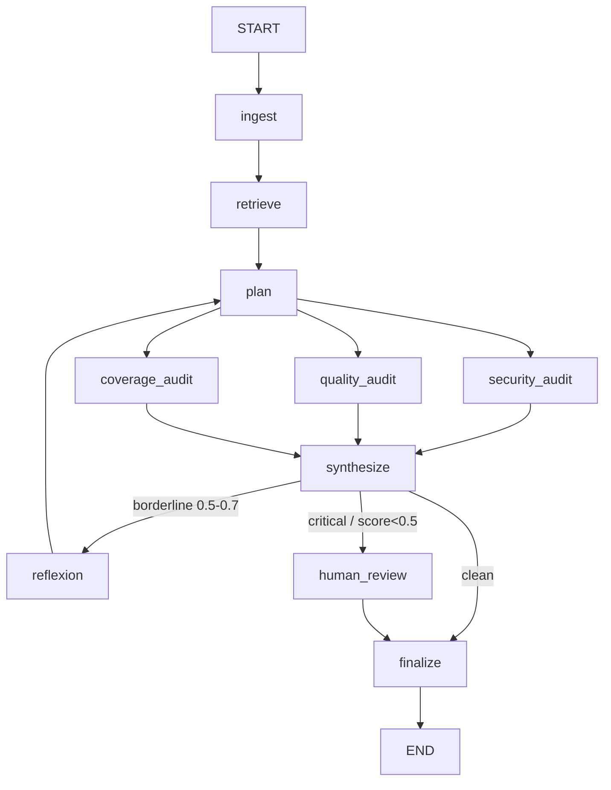

# LangGraph PR Audit Agent 🏦🔒

A multi-agent, stateful AI system that automates Pull Request security and quality audits. Framed for banking: every change touching payment logic, customer PII, or auth gets reviewed before merge.

## 📖 What is this project?
In a bank, a code change that touches auth or payment paths needs a security review before it merges. This agent does that review automatically.

It uses **LangGraph** to orchestrate a team of specialized agents over a GitHub PR diff, applying the **ReAct** (Reason + Act) pattern to check changes against OWASP Top 10, SQL injection, PII leaks, and authentication bypasses.

### Core Technologies:
- **LangGraph:** Stateful multi-agent orchestration and routing.
- **Gemini 2.5 Flash (audits) + Gemini 2.5 Pro (reflexion):** Core LLM reasoning engine (via `google-genai`).
- **Instructor:** Enforces strict structured JSON outputs (Pydantic V2 schemas).
- **Python 3.12+:** Core language.
- **pgvector (Postgres 16, Docker):** Vector store for similar-PR precedent retrieval (HNSW, cosine > 0.7).
- **Gemini Embeddings (`gemini-embedding-001`, 768-dim):** Embeds diffs for retrieval.
- **LangSmith:** Tracing + custom output-quality evaluators.
- **Resilience layer (`src/llm_retry.py`):** Centralized retry / quota-aware backoff / API-key rotation across every Gemini call, with fail-closed semantics.

---

## 🏗️ Architecture



**Routing rules** (precedence: human review > reflect > finalize)
- `should_reflect`: **any** of the three scores (security/quality/test) in [0.5, 0.7], OR an auth-related file changed with zero **security** findings ("suspicious silence" - security-only heuristic). Capped at 2 loops (`iteration_count` guard).

- `needs_human_review`: any CRITICAL finding (any dimension), or **any** score < 0.5. Graph pauses here (`interrupt_before`).


### How the pipeline works
1. **Ingest** parses the raw diff into added/removed lines + a `files_changed` list.
2. **Retrieve** embeds the diff (`gemini-embedding-001`) and queries pgvector for similar past audits (cosine > 0.7), feeding precedent into the plan. Degrades gracefully if the DB is unavailable.
3. **Plan** (`gemini-2.5-flash`) triages the diff once - produces an `AuditPlan` (focus areas, risk level, audit depth). This is **Plan-Execute**: the three audits each receive a *targeted* brief instead of re-reading the whole diff cold.
4. **Three audits run in parallel** - security (OWASP/SQLi/PII/authn), quality (smells, magic numbers, DRY/SOLID), and coverage (missing tests). All are **plan-aware** (they read `audit_plan.focus_areas`).
5. **Synthesize** computes deterministic, severity-weighted scores ($0, no LLM) the router can act on.
6. **Reflexion** (`gemini-2.5-pro`) - on a borderline result, a *smarter* model critiques the audit, identifies gaps, and loops back to plan for a sharper second pass (max 2 loops).
7. **Human review / finalize** - on a CRITICAL finding or score < 0.5, the graph **pauses** at `human_review` (`interrupt_before`) for a human decision (see [Human-in-the-Loop](#-human-in-the-loop-pause--inject--resume)); otherwise it finalizes. `finalize` assembles the markdown report and persists it to pgvector as precedent.

### Reliability (banking-grade fail-closed)
Every Gemini call routes through `src/llm_retry.py`, which:
- Honours per-minute 429s (waits the server's `retryDelay`), and on per-day quota or a
  blocked key **rotates** `GEMINI_API_KEY → KEY2 → KEY3 → KEY4`.
- Raises `QuotaExhaustedError` only when **all** keys are unusable - the graph then aborts
  and emits **no report** rather than a misleading "all clear".
- If an audit node degrades (transient API error), it records to `node_errors`; `synthesize`
  forces all scores to `0.0` when an audit actually failed, so a transport failure can never
  masquerade as a clean PR. **A failure is never a false pass.**

---

## 🚀 How to Install & Start

### 1. Clone & Environment Setup
```bash
# Clone the repository
git clone <your-repo-link>
cd langgraph-pr-audit-agent

# Create and activate a virtual environment (Windows)
python -m venv venv
venv\Scripts\activate
```

### 2. Install Dependencies
```bash
pip install -r requirements.txt
```

### 3. Environment Variables
Copy `.env.template` file to `.env` file in the root directory and add your API keys:
```bash
# bash and powershell
cp .env.template .env

# windows command prompt (cmd)
copy .env.template .env
```

### 4. Start the vector store (Docker)
The agent persists each audit to pgvector so future similar PRs can retrieve precedent.
```bash
docker compose up -d        # starts pgvector/pgvector:pg16 on $POSTGRES_PORT
```

---

## 🧪 How to Test

### Run the Unit Tests (Pytest)
Unit tests run instantly and cost $0, asserting that your deterministic logic (like diff parsing) works perfectly.
```bash
# Run tests with verbose output
pytest -v

# Fast, $0 unit tests (mocked LLM) - excludes live integration tests
pytest -m "not integration" -v
```

### Run the E2E Smoke Test
The smoke test pushes a sample PR diff through the entire LangGraph state machine with a **live** Gemini call:
- **SQL-injection auth diff** → high-risk path: escalates and pauses at `human_review`.


```bash
# Run the full graph smoke tests
python main.py --test
```

---

## 🧑‍⚖️ Human-in-the-Loop (pause → inject → resume)

A high-risk PR shouldn't auto-merge on the model's say-so. The graph is compiled with
`interrupt_before=["human_review"]`, so when `synthesize` routes to `human_review`
(any **CRITICAL** finding, or any score **< 0.5**) the graph **pauses** before that node
and hands control to a human.

### Run the interactive audit
```bash
python main.py --demo
```

### How it works
1. **First pass** - the graph streams from `ingest` to `synthesize`. If clean, it goes
   straight to `finalize`. If high-risk, the stream **ends early**: the checkpointer
   (keyed on `thread_id`) freezes the run *before* `human_review`.
2. **Pause detected** - `app.get_state(config).next` contains `"human_review"`. The runner
   prints all three scores and lists every CRITICAL finding so the reviewer sees *why* it stopped.
3. **Inject** - the reviewer types `approve` / `reject` / `needs-changes`;
   `app.update_state(config, {"human_decision": decision})` writes it into the checkpoint.
4. **Resume** - `app.stream(None, config=config)` continues from the interrupt
   (`None` = "no new input, keep going"). The graph runs `human_review → finalize`, and the
   decision is stamped onto the final report.

> Because state is durable via the checkpointer, the pause can span a human coffee break
> (or a process restart) without losing the in-flight audit.

---

## 🔭 Observability & Tracing (LangSmith)

Every LLM call in the graph is traceable. LangSmith auto-instruments the run from environment
variables alone - no application code needed - so each audit produces a full node-by-node
trace (`ingest → retrieve → plan → security/quality/test audits → synthesize → reflexion`),
including the exact prompt, model, latency, token counts, and the Instructor-validated output
for every Gemini call.

Set these in your `.env`:
```bash
LANGCHAIN_TRACING_V2=true
LANGCHAIN_API_KEY=your_langchain_api_key_here
LANGCHAIN_PROJECT=langgraph-pr-audit-agent
LANGCHAIN_ENDPOINT=https://api.smith.langchain.com
```

Then run any audit and view the trace:
```bash
python main.py --test        # or --demo, or any real run
```
Open **https://smith.langchain.com** → project **`langgraph-pr-audit-agent`**. Each run is one
trace; drill into any node to see its prompt and structured output. This is what makes a
multi-step agent debuggable - when a score looks wrong you can see *which* node produced it and
*why*, instead of guessing from the final report.

> **Why LangSmith here, and not a second backend?** LangSmith covers both tracing *and* the
> output-quality evaluators below, so it earns its place. A self-hostable backend (Langfuse) is
> deferred to the dedicated LLMOps week, where the "zero data egress / regulated banking" story
> is built properly as its own self-hosted Docker stack - rather than bolting a redundant second
> tracer onto this repo.
>
> Tracing is **optional and additive**: with no `LANGCHAIN_*` vars set, the pipeline runs
> identically, just untraced.

## 📊 Output-Quality Evaluators (LangSmith)

Passing the smoke test proves the pipeline *ran*. `src/evaluators.py` adds custom LangSmith
evaluators that score whether the **output is trustworthy**:

- **`every_finding_has_cwe`** - traceability: every security finding must carry a `cwe_id`.
- **`score_consistent_with_findings`** - sanity: a high `security_score` alongside a CRITICAL
  finding is a contradiction and fails.

These run **offline, on demand** against a curated dataset - they are *not* part of a normal
audit run:
```bash
# Requires LANGCHAIN_API_KEY and a LangSmith dataset named "pr-audit-eval-set"
python -m src.evaluators
```

> This is the seed of a discipline that matures later into a CI **eval gate** (auto-run on
> any prompt/retrieval change, fail the build below a quality threshold).