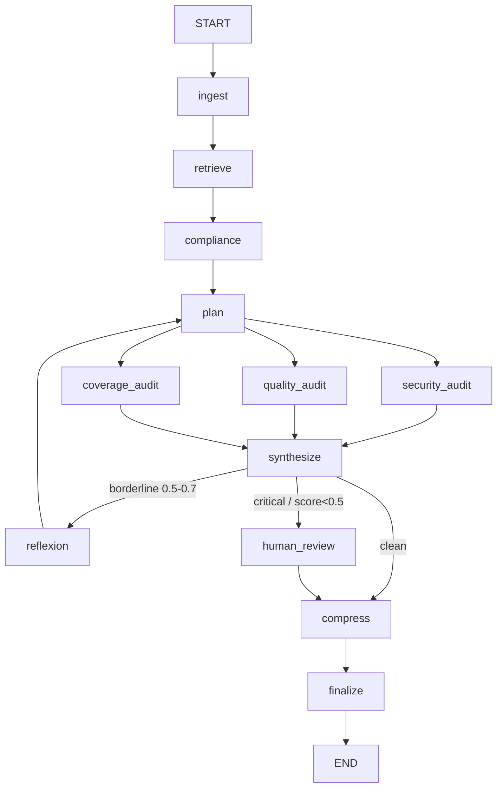

# LangGraph PR Audit Agent

A multi-agent, stateful AI system that automates Pull Request security and quality audits. Framed for banking: every change touching payment logic, customer PII, or auth gets reviewed before merge.

## What is this project?
In a bank, a code change that touches auth or payment paths needs a security review before it merges. This agent does that review automatically.

It uses **LangGraph** to orchestrate a team of specialized agents over a GitHub PR diff, applying the **ReAct** (Reason + Act) pattern to check changes against OWASP Top 10, SQL injection, PII leaks, and authentication bypasses.

### Core Technologies

**Orchestration & language**
- **LangGraph:** Stateful multi-agent orchestration and routing (the graph runs on a nested `AMSState`).
- **Python 3.12+ / asyncio:** The three audits are `async` nodes that run **concurrently** - their Gemini calls overlap on worker threads (`asyncio.to_thread`) instead of running in series.

**LLM & structured output**
- **Gemini 2.5 Flash (audits) + Gemini 2.5 Pro (reflexion):** Core LLM reasoning engine (via `google-genai`).
- **Instructor:** Enforces strict structured outputs (Pydantic V2 schemas) - no hand-rolled JSON parsing.

**Memory & retrieval** - see [Agent Memory](#agent-memory-four-types-one-system)
- **pgvector (Postgres 16, Docker):** Backs the four-type agent memory (HNSW, cosine > 0.7).
- **Gemini Embeddings (`gemini-embedding-001`, 768-dim):** Embeds diffs (semantic/episodic recall) and proposed rules (near-duplicate detection in [rule governance](#rule-governance-reviewing-what-the-agent-proposes)).
- **Context management:** A [`TokenBudgetManager`](#context-budgeting-tokenbudgetmanager) (priority-ordered, never silent) and an in-graph [history-compression node](#history-compression-the-compress-node) for long sessions.

**Compliance grounding (MCP)** - see [Compliance grounding](#compliance-grounding-over-mcp)
- **Model Context Protocol (`mcp`, `langchain-mcp-adapters`):** The agent is both an MCP **client** (it consumes tools over stdio) and an MCP **server** (`compliance-rag`) that any MCP client - Claude Desktop, a raw-SDK client - can call with zero glue.
- **Multi-framework rule packs (`packs/*.yaml`):** Pluggable regulatory corpora (RBI, HIPAA, PCI-DSS, OWASP, GDPR) - adding a framework is dropping a YAML file, no code change. A finding cites the exact clause it breaks.

**Reliability** - see [Reliability](#reliability-banking-grade-fail-closed)
- **Resilience layer (`src/llm_retry.py`, `tenacity`):** Centralized retry / server-directed backoff / multi-key rotation across every Gemini call, **thread-safe** under the concurrent fan-out, with fail-closed semantics. Classifies a 429 by its cause - per-minute throttle (wait the server's stated delay), per-day quota or depleted billing credits (rotate keys), blocked key (rotate immediately) - never one blunt retry policy.

**Observability & ops**
- **LangSmith:** Tracing + custom output-quality evaluators.
- **GitHub Actions:** A free test job on every PR plus an opt-in [pre-merge audit gate](#continuous-integration-audit-on-every-pr) that blocks merge on an unaddressed critical finding.

---

## Architecture



**Routing rules** (precedence: human review > reflect > finalize)
- `should_reflect`: **any** of the three scores (security/quality/test) in [0.5, 0.7], OR an auth-related file changed with zero **security** findings ("suspicious silence" - security-only heuristic). Capped at 2 loops (`iteration_count` guard).

- `needs_human_review`: any CRITICAL finding (any dimension), or **any** score < 0.5. Graph pauses here (`interrupt_before`).


### How the pipeline works
1. **Ingest** parses the raw diff into added/removed lines + a `files_changed` list.
2. **Retrieve** embeds the diff (`gemini-embedding-001`) and queries pgvector for similar past audits (cosine > 0.7), feeding precedent into the plan. Degrades gracefully if the DB is unavailable.
3. **Compliance** (`gemini-2.5-flash`) triages whether the diff is regulated and, if so, pulls matching regulatory passages from the multi-framework corpus over MCP (see [Compliance grounding](#compliance-grounding-over-mcp)). An unregulated diff (docs, typos, tests) short-circuits with no lookup and no wasted call. The passages are carried forward so the security audit can cite the clause a finding breaks.
4. **Plan** (`gemini-2.5-flash`) triages the diff once - produces an `AuditPlan` (focus areas, risk level, audit depth). This is **Plan-Execute**: the three audits each receive a *targeted* brief instead of re-reading the whole diff cold.
5. **Three audits run concurrently** - security (OWASP/SQLi/PII/authn), quality (smells, magic numbers, DRY/SOLID), and coverage (missing tests). They are `async` nodes whose Gemini calls overlap (the blocking client runs on a worker thread via `asyncio.to_thread`), so the three LLM round-trips happen at once rather than in series - real concurrency, not just LangGraph's structural fan-out. All are **plan-aware** (they read `audit_plan.focus_areas`).
6. **Synthesize** computes deterministic, severity-weighted scores ($0, no LLM) the router can act on.
7. **Reflexion** (`gemini-2.5-pro`) - on a borderline result, a *smarter* model critiques the audit, identifies gaps, and loops back to plan for a sharper second pass (max 2 loops).
8. **Human review** - on a CRITICAL finding or score < 0.5, the graph **pauses** at `human_review` (`interrupt_before`) for a human decision (see [Human-in-the-Loop](#human-in-the-loop-pause--inject--resume)); otherwise it skips straight on.
9. **Compress** - both paths into finalize funnel through a `compress` node that compacts the oldest portion of the session history when it has grown large (or when forced); a no-op pass-through otherwise (see [History compression](#history-compression-the-compress-node)).
10. **Finalize** - assembles the markdown report and persists it to pgvector as precedent (and, when compression fired, stores the *compacted* history as the session episode).

### Compliance grounding over MCP
A finding is more useful when it cites the rule it breaks. The agent grounds its security findings in a real regulatory corpus, served and consumed over the **Model Context Protocol (MCP)**.

The corpus is pluggable. Frameworks live in `packs/*.yaml` data files; RBI (banking), HIPAA (healthcare), PCI-DSS (cards), OWASP (app security) and GDPR (privacy) ship by default. Adding one is dropping a YAML file and re-running the idempotent seeder - no code change. The split that makes this work: `category` (security/quality/coverage, what the engine reasons over) is a typed enum with a DB `CHECK`, while `framework` is a free-form indexed tag, the axis the world keeps extending. The core stays small; the corpus stays open.

The agent is on both ends of the protocol. As a *client*, the `compliance` node connects via `MultiServerMCPClient` and calls `search_compliance_docs` over stdio. It fails soft - if the server can't start, or the diff isn't regulated, the audit carries on with empty context and a visible trace line instead of crashing or quietly reporting "clean". As a *server*, `src/mcp/compliance_rag_server.py` (`FastMCP`) exposes that same retrieval as a tool whose `@mcp.tool()` docstring *is* the schema the calling model reads. Anything that speaks MCP - Claude Desktop, a raw-SDK client - can call it with no glue, because the tool is a protocol endpoint rather than a Python import trapped in this process.

When the diff is regulated, the retrieved passages go into the security-audit prompt and the model cites the clause directly. A planted SQL-injection diff produces a finding with a `Citations:` block quoting the *RBI Cyber Security Framework* and *OWASP A03:2021 - Injection*. On an unregulated diff the injection is empty, so there's no token cost when there's no rule to cite.

```bash
docker compose up -d
python -m src.db.vectorstore        # creates the compliance_docs table + HNSW index
python -m scripts.seed_compliance   # loads every packs/*.yaml (idempotent)
```

### Reliability (banking-grade fail-closed)
Every Gemini call routes through `src/llm_retry.py`, which:
- Backs off on per-minute 429s **server-directed first**: it waits the delay the server asks
  for (`retryDelay`) when present, and only falls back to exponential backoff
  (`wait_exponential(min=1, max=30)`, capped at 90s) when it doesn't - so the client never
  guesses a wait the server already specified. On per-day quota or a blocked key it instead
  **rotates** `GEMINI_API_KEY → KEY2 → KEY3 → KEY4`.
- Raises `QuotaExhaustedError` only when **all** keys are unusable - the graph then aborts
  and emits **no report** rather than a misleading "all clear".
- **Rotation is concurrency-safe.** Because the three audits run at once, they can all hit a
  dead key in the same instant and each try to rotate - which would skip past good keys
  (`KEY1 → KEY2 → KEY3 → KEY4` for a single exhaustion). A `threading.Lock` plus a
  *double-checked* rotation fixes this: under the lock a thread re-checks whether the key it
  saw fail is still current; if another thread already rotated, it rides along instead of
  rotating again, and clients are rebound inside the lock so a key and its client never
  desync. The lock lives in the retry layer (the one door every Gemini call passes through),
  not on the nodes.
- If an audit node degrades (transient API error), it records to `node_errors`; `synthesize`
  forces all scores to `0.0` when an audit actually failed, so a transport failure can never
  masquerade as a clean PR. **A failure is never a false pass.**

---

## Agent Memory (four types, one system)

The agent doesn't just react to the PR in front of it - it remembers. Memory is organised as four
types under one entry point, `AgentMemorySystem` (`src/memory.py`), borrowing the standard
cognitive split so each kind of memory has a clear job:

| Type | Holds | Where it lives | Retrieved by |
|------|-------|----------------|--------------|
| **In-context** | The live run's working state (diff, findings, scores) | `AuditState`, in the graph | direct read |
| **Semantic** | Similar past PR audits (precedent) | `pr_audits` (pgvector) | cosine similarity |
| **Episodic** | Compressed past-session summaries | `session_episodes` (pgvector) | cosine similarity |
| **Procedural** | Org audit rules / templates, keyed by category | `procedural_rules` (Postgres) | exact category lookup |

> A run also carries a transient `compressed` channel - the compacted history produced by the
> `compress` node, which `finalize` promotes into the episodic store. See
> [History compression](#history-compression-the-compress-node).

**Persistent locally, ephemeral in CI.** The three persistent memory types live in Postgres, so how
much the agent "remembers" depends on where it runs:

- **Locally** the Docker pgvector container holds its data across runs, so semantic and episodic
  recall accumulate - the agent genuinely learns from past audits over time.
- **In GitHub Actions** the [pre-merge gate](#continuous-integration-audit-on-every-pr) spins up a
  fresh pgvector **service container per run**, which is torn down when the job ends. So a CI audit
  starts from an empty store with no prior records - recall simply finds nothing and the audit
  degrades gracefully (it never depends on history). This is deliberate: the gate audits *this* PR's
  diff, and a clean, reproducible per-run database is the right tradeoff for CI over a persistent one.

The persistent three share one embed + pgvector spine. Procedural rules are *retrieved* by exact
category lookup (not similarity), but each rule is **also embedded** - not for retrieval, but so the
review tool can flag near-duplicate proposed rules by cosine similarity (see
[Rule governance](#rule-governance-reviewing-what-the-agent-proposes)). Embeddings are memoised per
process (`vectorstore.embed`, bounded LRU) so the same diff embedded by more than one node in a run
costs a single API call.

**The state *is* the memory system.** The graph runs on a nested `AMSState`: an `audit` substate
(the in-context `AuditState`) plus `semantic` / `episodic` / `procedural` channels as siblings. The
catch with nesting: LangGraph's reducers only apply to top-level channels, so a custom `merge_audit`
reducer restores the per-field accumulation the audit substate needs - without it the parallel audit
fan-out (security/quality/coverage all write at once) would silently clobber each other's messages.

**All four types feed the audit, not just store data.** Memory is recalled once per run (in
`retrieve`) into the shared channels, then consumed where it's useful:

- **Semantic + episodic** precedent flows into the **plan** node, which uses "have we seen a change
  like this before?" to steer triage (focus areas, audit depth).
- **Procedural** rules are injected **verbatim** into each audit node's prompt, per domain - the
  security auditor sees the security rules, quality sees quality rules, coverage sees coverage rules
  - so a standing org rule is enforced to the letter, not just paraphrased into a focus area.

This closes the loop: retrieved context actually changes the audit, rather than being stored and
ignored.

### Rules have a lifecycle (and the agent can propose its own)

Procedural rules carry a `status` so the system can tell a trusted policy from an unvetted
suggestion:

| Status | Origin | Injected into audits? |
|--------|--------|------------------------|
| `seeded` | Human-authored baseline policy | Yes - active immediately |
| `learned_pending` | Proposed by the agent from its own findings | **No** - awaiting human review |
| `learned_approved` | A human approved a pending rule | Yes |
| `rejected` | A human rejected a proposed rule | No - kept so it is not re-proposed |
| `retired` | A human deactivated a once-active rule | No - kept so it is not re-learned |

After an audit, the agent promotes its strongest findings (critical/high only, deduplicated) into
**proposed** rules - but they land as `learned_pending` and are **never enforced until a human
approves them**. This is deliberate: a rule derived from the agent's own output is a feedback loop,
and a single false positive would otherwise become a permanent rule injected into every future
audit. So the agent *proposes*; a human *approves*. Only `seeded` and `learned_approved` rules ever
reach a prompt.

Each proposed rule also records the **human's verdict on the PR it was learned from**
(`source_decision`: approve / reject / needs-changes). Learning is *not* gated by that verdict - a
rejected PR still proposes rules - but the reviewer sees the provenance ("learned from a PR the human
rejected") and weighs it when approving. The PR decision informs the rule decision; it does not make
it.

---

## Rule governance (reviewing what the agent proposes)

Proposed rules sit inactive until a human approves them. That review happens in a standalone
terminal tool - **not** during an audit - because rule governance is out-of-band store maintenance:
learning happens at the end of a run (after the in-graph human pause), and rules proposed on clean
runs never hit that pause, so they need their own review surface.

```bash
python -m scripts.review_rules
```

It runs in two phases:

**1. Review proposed rules** (`learned_pending`). For each one it shows the rule, the verdict on the
PR it was learned from, and any near-duplicate existing rules (by cosine similarity) so you can catch
reworded re-learns. You answer per rule:

| Key | Action | Effect |
|-----|--------|--------|
| `a` | **approve** | `learned_pending → learned_approved` - the rule is now **active** and injected into future audits |
| `r` | **reject** | `learned_pending → rejected` - kept in the store (so the agent will not re-propose it), never injected |
| `s` | **skip** | left as `learned_pending` for a later review |

**2. Manage active rules** (`seeded` + `learned_approved`). Lists each with its id, then accepts:

| Command | Action | Effect |
|---------|--------|--------|
| `retire <id>` | **deactivate** | stops injecting the rule but keeps the row, so a learned rule is not silently re-learned next run (the un-learn-safe off switch) |
| `delete <id>` | **hard-remove** | deletes the row entirely; for a *learned* rule the tool warns first, because the same finding will be re-proposed on the next matching audit |
| `done` | finish | exit the tool |

> **Approving everything quickly:** there is no bulk "approve all" - approval is deliberately per
> rule, since each is a standing policy the agent will enforce verbatim on every future PR. Press `a`
> for each rule you want active. (Seed *trusted* baseline policy instead via `scripts/seed_rules.py`,
> which writes rules as `seeded` - active immediately, no review needed.)

> The similarity hint is **advisory only**: cosine similarity is a rough proxy for "duplicate", not
> proof, and the threshold is untuned. The tool shows the score and you decide - it never
> auto-removes a rule. The human approval gate is the real deduplicator.

---

## History compression (the `compress` node)

A long-running session accumulates messages - plan, three audit results, reflexion passes, the
human decision. Left unbounded, that history grows toward the model's context limit. The `compress`
node folds the **oldest ~50%** of the message history into a single summary that preserves the
signal (decisions, scores, CRITICAL/HIGH findings, file paths) and discards exploratory chatter,
keeping the newest messages verbatim.

It sits at a single choke point: **both** paths into `finalize` (the clean path and the
post-`human_review` path) route through `compress`, so finalize always sees a consistent state. When
compression doesn't fire, the node is a **pass-through** - it returns nothing and the graph flows on
untouched - so a normal short audit pays nothing for it.

**Two triggers (an OR gate):**

| Trigger | Source | Meaning |
|---------|--------|---------|
| **auto** | `should_compress` at 80% of a token budget | the session genuinely approached the limit |
| **force** | the `--large` flag, threaded into state as `force_compress` | compress regardless of size (demo / explicit) |

**Where the result goes.** The working transcript (`audit.messages`) is **append-only by design** -
its reducer protects the parallel audit fan-out from clobbering itself - so compression cannot
overwrite it. Instead the compacted history is written to its own `compressed` channel
(last-writer-wins). This is also conceptually correct: a compressed session *is* proto-episodic
memory, so `finalize` stores it as the session **episode** when present (falling back to a structured
findings summary otherwise). That closes a loop - a compressed session this run becomes precedent a
future run can recall.

**Resilience.** The summary is produced by `gemini-2.5-flash`; if the model is unavailable, a no-LLM
fallback keeps only the signal lines (decision/plan/findings prefixes) so compression still happens
and never loses the important content. `QuotaExhaustedError` propagates (same fail-closed rule as the
audit nodes).

> Like the budget manager below, the compression mechanism is generic - it operates on a plain list
> of stringifiable messages and knows nothing about `AuditState`.

---

## Context budgeting (`TokenBudgetManager`)

When you assemble a prompt from several pieces - a system prompt, the diff, retrieved precedent,
chat history - and the total can outgrow the model's window, you need to decide *what to drop* in
priority order rather than letting the call fail or truncate at a random byte. `TokenBudgetManager`
(`src/token_budget.py`) does that, and **logs every trim** so nothing is ever dropped silently.

It is generic by design: it imports nothing from this app (no `AuditState`, no DB). It operates on a
plain list of labelled, prioritised text `Segment`s and a budget, and returns the segments that fit
plus a trim log. The caller is what knows about your state - the manager just honours the priorities
you assign.

```python
from src.token_budget import TokenBudgetManager, Segment

# priority: lower number = higher priority. 0 = mandatory (never trimmed).
segments = [
    Segment(0, "system",     system_prompt),    # always kept
    Segment(1, "query",      user_diff),         # the current change
    Segment(2, "chunk:auth", retrieved_chunk),   # retrieved context, droppable
    Segment(3, "history:0",  old_message),       # oldest history, dropped first
]

kept, trim_log = TokenBudgetManager(budget_tokens=8000).fit(segments)

prompt = assemble(kept)          # build your prompt from what survived
for line in trim_log:            # never silent: surface what was dropped and why
    print(line)
```

**Priority convention:** `0` = system prompt (mandatory) · `1` = query / current diff · `2` =
retrieved chunks by relevance · `3+` = history. To trim **oldest history first**, give older
messages a higher priority number (e.g. `3 + age`) - the manager sorts by `(priority, input order)`,
so a naive all-equal priority would trim the *newest* first, which is the wrong end.

**Swapping the token counter:** the estimate is a dependency-free `len(text) // 4` heuristic - fine
for *deciding what to drop* (it doesn't need to be exact). The `counter` parameter lets you plug in a
real tokenizer when you want precision:

```python
TokenBudgetManager(budget_tokens=8000, counter=my_real_tokenizer)
```

### Plug-and-play: using it for very large (1M+ token) PR diffs

This repo does **not** route the live audit through the budget manager, and that is deliberate: a
single PR diff is far smaller than Gemini's ~1M-token window, so an in-band budget check here would
always keep everything, trim nothing, and only add latency. The class and its tests are the artifact;
it is demonstrated under synthetic oversized load in `tests/test_token_budget.py`.

If you are cloning this to handle genuinely huge diffs, the budget manager is the **last** mile, not
the whole fix. A diff larger than the model window breaks in three places, in this order:

1. **Embedding (breaks first).** `retrieve` and `finalize` embed the diff for similarity search and
   storage, and embedding models have a much smaller input limit than the chat window. You cannot fix
   this by trimming the text before embedding - a trimmed embedding represents a *different* text than
   the real diff, so similarity search returns wrong results. The fix is **chunked ingestion +
   retrieval** (split the diff per file/hunk, embed each chunk, retrieve the relevant ones).
2. **Parsing.** `parse_github_diff` (`src/nodes/ingest.py`) keeps every added/removed line, so a huge
   diff stays huge after parsing. You need a pre-reduction step (per-file summaries or changed-hunk
   headers).
3. **Prompt assembly (the budget manager's job).** Once the pieces are reasonably sized, route the
   prompt assembly in `plan.py` (and the audit nodes) through `TokenBudgetManager.fit(...)` instead of
   concatenating the diff and precedent directly, then set `budget_tokens` to your model's real window
   and (optionally) pass a real `counter`.

In short: handling a 1M+ diff is primarily a chunking/RAG problem (steps 1-2); the budget manager
cleanly handles the final fit (step 3) and is built to drop into that pipeline unchanged.

---

## How to Install & Start

### 1. Clone & Environment Setup
```bash
# Clone the repository
git clone <your-repo-link>
cd langgraph-pr-audit-agent

# Create and activate a virtual environment (Windows)
python -m venv venv
venv\Scripts\activate
```

### 2. Install Dependencies
```bash
pip install -r requirements.txt
```

### 3. Environment Variables
Copy `.env.template` file to `.env` file in the root directory and add your API keys:
```bash
# bash and powershell
cp .env.template .env

# windows command prompt (cmd)
copy .env.template .env
```

### 4. Start the vector store (Docker)
The agent persists each audit to pgvector so future similar PRs can retrieve precedent.
```bash
docker compose up -d              # starts pgvector/pgvector:pg16 on $POSTGRES_PORT
python -m src.db.vectorstore      # create the tables + HNSW index (idempotent, safe to re-run)
python -m scripts.seed_rules      # load baseline org rules (idempotent; re-run adds only new ones)
```
`docker compose up -d` only starts an empty Postgres. The second command creates the
`vector` extension and the three tables the agent reads/writes. It is idempotent
(`CREATE TABLE IF NOT EXISTS`), so re-running it is harmless. The third loads the baseline
org rules the audit enforces - without it the procedural-rules table is empty and that check
is a no-op. It dedups, so editing the rule list and re-running only inserts what's new.

---

## In case you have to NUKE the schema
> **Destructive - read before running.** This permanently deletes all stored
> audits, session episodes, and rules. Only use it when you want a clean slate
> (e.g. after a schema change that `CREATE TABLE IF NOT EXISTS` can't apply to an
> existing table).
```bash
python -m src.db.vectorstore drop # drops all tables; prompts for 'yes' first
python -m src.db.vectorstore      # rebuild an empty schema with the latest columns
```
The `drop` command prints a red warning and waits for you to type `yes`;
anything else aborts and nothing is dropped. It removes only the tables (their
indexes go with them); the `vector` extension is left in place.

---

## How to Test

### Run the Unit Tests (Pytest)
Unit tests run instantly and cost $0, asserting that your deterministic logic (like diff parsing) works perfectly.
```bash
# Run tests with verbose output
pytest -v

# Fast, $0 unit tests (mocked LLM) - excludes live integration tests
pytest -m "not integration" -v
```

### Run the E2E Smoke Test
The smoke test pushes a sample PR diff through the entire LangGraph state machine with a **live** Gemini call:
- **SQL-injection auth diff** → high-risk path: escalates and pauses at `human_review`.


```bash
# Run the full graph smoke tests
python main.py --test
```

### Measure audit latency
`scripts/bench_audit.py` runs the full audit on a fixed diff several times and reports min / median /
max wall-clock latency - a baseline to compare against once provider routing and prompt caching land.
It times the run; per-call token counts are in the LangSmith trace (see below).
```bash
python -m scripts.bench_audit     # live LLM calls (one full audit per run) - keep the run count modest
```

---

## Human-in-the-Loop (pause  inject  resume)

A high-risk PR shouldn't auto-merge on the model's say-so. The graph is compiled with
`interrupt_before=["human_review"]`, so when `synthesize` routes to `human_review`
(any **CRITICAL** finding, or any score **< 0.5**) the graph **pauses** before that node
and hands control to a human.

### Run the interactive audit
```bash
python main.py --demo
```

### How it works
The audit nodes are `async`, so the graph is driven through LangGraph's async API
(`astream` / `aget_state` / `aupdate_state`):

1. **First pass** - the graph streams from `ingest` to `synthesize` (`app.astream(...)`). If clean,
   it goes straight to `finalize`. If high-risk, the stream **ends early**: the checkpointer
   (keyed on `thread_id`) freezes the run *before* `human_review`.
2. **Pause detected** - `(await app.aget_state(config)).next` contains `"human_review"`. The runner
   prints all three scores and lists every CRITICAL finding so the reviewer sees *why* it stopped.
3. **Inject** - the reviewer types `approve` / `reject` / `needs-changes`;
   `app.aupdate_state(config, {"audit": {"human_decision": decision}})` writes it into the
   checkpoint (nested under `audit` so the `merge_audit` reducer applies it to the substate).
4. **Resume** - `app.astream(None, config=config)` continues from the interrupt
   (`None` = "no new input, keep going"). The graph runs `human_review → finalize`, and the
   decision is stamped onto the final report.

> Because the run is frozen in a checkpointer keyed on `thread_id`, the pause can span a human
> coffee break without losing the in-flight audit. By default that checkpoint lives in memory, so it
> survives within the process but not a restart; run with `--durable` to persist it to SQLite and
> resume across restarts (see [Checkpointing](#checkpointing-in-ram-by-default-durable-on-demand)).

### Checkpointing: in-RAM by default, durable on demand

The checkpointer is the component that freezes a thread's state at the human-review interrupt. It is
**pluggable** - the graph topology and the `interrupt_before` pause are identical regardless of where
the thread is stored; only durability changes:

| Mode | Checkpointer | Threads survive a process restart? | Use |
|------|-------------|-----------------------------------|-----|
| default | `MemorySaver` (in-RAM) | No | one-shot runs, CI gating (CI never resumes - it gates on the exit code) |
| `--durable` | `AsyncSqliteSaver` (SQLite file) | Yes | a human review that spans a restart; resume a paused thread later |

```python
# src/graph.py - one builder, two ways to compile it
app = build_app(MemorySaver(serde=serde))      # default, compiled at import

@asynccontextmanager
async def durable_app(db_path="checkpoints.sqlite"):
    async with AsyncSqliteSaver.from_conn_string(db_path) as saver:
        saver.serde = serde                     # same allow-listed serde -> domain types round-trip
        yield build_app(saver)
```

It has to be the *async* saver, not the sync one. The audit nodes are `async`, so the graph is
driven by `app.astream` / `aget_state`, and those call the async checkpoint methods. `AsyncSqliteSaver`
(the `aio` variant) implements them; the plain `SqliteSaver` raises under the async driver - a trap
worth knowing before you reach for the obvious import. The SQLite dependency is imported inside
`durable_app`, not at module top, so the default in-RAM path never needs the optional package.

Both backends share one serializer. They use the same `JsonPlusSerializer`, whose msgpack allow-list
is derived from the enums and models in `src/state.py`. That is what makes `Severity` and the
`*Finding` models survive a SQLite round-trip as real objects rather than degraded dicts - the same
serde bug I hit earlier with the in-RAM saver would otherwise come straight back on the durable path.

```bash
python main.py --demo --durable      # interactive audit; thread persisted to checkpoints.sqlite
```

---

## Running the agent (all modes)

`main.py` runs in a few modes, selected by flag:

| Command | Diff audited | Compression | Human review |
|---------|--------------|-------------|--------------|
| `python main.py --test` | bundled SQL-injection fixture | n/a (smoke test) | n/a |
| `python main.py --demo` | bundled SQL-injection fixture | auto only (won't fire on a small diff) | interactive prompt |
| `python main.py --demo --large` | bundled fixture | **forced** (see it run on the fixture) | interactive prompt |
| `python main.py --large` | **the real diff** vs the branch you're merging into | **forced** | interactive (local) / build-gate (CI) |
| `python main.py` *(no flags)* | **the real diff** vs the branch you're merging into | auto only | interactive (local) / build-gate (CI) |

- **`--test`** runs the end-to-end smoke test (one live Gemini call) and exits.
- **`--demo`** runs the interactive audit on a known fixture - the quickest way to see the whole
  pipeline, including the human-in-the-loop pause. Add **`--large`** to force the compression pass so
  you can watch the `compress` node fire even though the fixture is small.
- **`--large`** (and the no-flag run) are the **real pre-merge gate**: they audit your actual changes
  against the branch you intend to merge into. `--large` additionally *forces* compression; the
  no-flag run lets compression auto-decide. See the gate section below.
- **`--durable`** (combinable with any run mode) persists the run's thread to a SQLite file so a
  human-review pause can resume across a process restart instead of living only in memory. See
  [Checkpointing](#checkpointing-in-ram-by-default-durable-on-demand).

### The pre-merge gate (`--large` on a real diff)

When you run `--large` (or no flags) outside the demo, the agent audits the diff between your branch
and its merge target - the same changes a reviewer would see in the PR.

**Locally**, two things are required:

1. **You are prompted for the target branch.** The gate asks
   `Merge into which branch? [main]:` - press Enter for `main` or type another branch. The diff
   audited is `git diff origin/<that-branch>...HEAD`. Before auditing, the gate also runs a
   **read-only merge-compatibility check** (`git merge-tree`) and aborts if the branches conflict -
   there is no point auditing a diff that can't even merge.
2. **You must be logged into the GitHub CLI.** Run `gh auth login` first. The gate reuses `gh`'s
   stored credential to read PR state - **no separate token is needed locally**. (If `gh` isn't
   logged in, the GitHub-dependent steps can't authenticate.)

```bash
gh auth login          # one-time, if not already done
python main.py --large # prompts for the target branch, then audits your changes
```

If no real diff is found against the chosen branch, the gate falls back to the bundled fixture (with
a printed warning) so the run still demonstrates the pipeline.

---

## Continuous Integration (audit on every PR)

The repo ships a GitHub Actions workflow (`.github/workflows/audit.yml`) with **two jobs**:

| Job | Runs | Cost | Needs |
|-----|------|------|-------|
| **`tests`** | every PR | free | nothing - just `pytest -m "not integration"` |
| **`gate`** | opt-in (see toggle) | LLM spend | a Postgres service + `GEMINI_API_KEY` secret |

### How the human gate works in CI

There is no terminal in CI, so the interactive prompt is replaced by an **exit-code gate**:

1. On a PR, the `gate` job runs `python main.py --large` against the PR's diff (base branch comes
   from `GITHUB_BASE_REF` automatically - no prompt).
2. If the audit **escalates** to human review (a CRITICAL finding or score < 0.5) and **no human has
   approved the PR yet**, the job **exits 1** - the required check fails and the merge is blocked.
3. A reviewer clicks **Approve** in the GitHub PR UI. GitHub re-triggers the workflow; this time the
   gate reads the PR's review state (via `gh`, authenticated by the auto-injected `GITHUB_TOKEN`),
   sees the approval, and **exits 0** - the merge is unblocked.

So the "human in the loop" is the PR reviewer acting asynchronously in GitHub, and the pause lives in
GitHub's state, not a blocked process. Interactive `input()` HITL stays a local-only experience.

### What to configure in GitHub (one-time)

Everything lives under *Settings → Secrets and variables → Actions*.

**Secrets** (the *Secrets* tab - sensitive values only):

| Secret | Required | Purpose |
|--------|----------|---------|
| `GEMINI_API_KEY` | **Yes** (for the `gate` job) | the audit's Gemini calls |
| `GEMINI_API_KEY2`, `GEMINI_API_KEY3`, `GEMINI_API_KEY4` | Optional | extra keys the resilience layer rotates to on quota exhaustion. The default workflow forwards only `GEMINI_API_KEY`; add a line per extra key in the `gate` job's `env:` if you want CI rotation too. |
| `LANGCHAIN_API_KEY` | Optional | enables LangSmith tracing of the gate's run. Only needed if you want CI traces; the audit runs identically without it. |
| `GITHUB_TOKEN` | **No - auto-injected** | GitHub Actions provides it for free; the gate uses it (via `gh`) to read the PR's approval state. You do not create this. |

The non-sensitive LangSmith settings (`LANGCHAIN_TRACING_V2`, `LANGCHAIN_PROJECT`, `LANGCHAIN_ENDPOINT`)
are **not** secrets - they are plain values already in the `gate` job's `env:`. Tracing switches on only
when `LANGCHAIN_API_KEY` is also present.

> **Do not copy your local `.env` wholesale into Secrets.** `DATABASE_URL` and the `POSTGRES_*`
> values are local-only: in CI the gate talks to its own pgvector **service container**
> (`postgres:postgres@localhost`, set in the workflow), not your machine's `audit:audit` database.
> Adding your local `DATABASE_URL` as a secret would point CI at a database that does not exist there.
> Only the API keys above belong in Secrets.

**Variables** (the *Variables* tab):

| Variable | Set to | Purpose |
|----------|--------|---------|
| `RUN_AUDIT_GATE` | `true` | turns the `gate` job on (it is **off by default**, so a fresh fork only runs the free `tests` job) |

### Tuning the gate (edit the YAML)

- **Force vs. auto compression in CI:** edit one line in the `gate` job's `env:`
  ```yaml
  env:
    USE_LARGE: "1"   # "1" = run `python main.py --large` (force compression)
                     # "0" = run `python main.py`        (compression auto-fires only)
  ```
- **Manual run instead of the variable:** trigger the workflow from the Actions tab
  (`workflow_dispatch`) with the `run_gate` input checked.
- **Block merges for real:** make the `gate` job a **required status check** in branch protection -
  otherwise a failing gate is advisory.

> **No `.env` needed for CI.** CI reads `GEMINI_API_KEY` from the secret and `DATABASE_URL` from the
> workflow - it never loads `.env`. Locally, your existing `.env` (`DATABASE_URL` + `GEMINI_API_KEY`)
> is unchanged by the gate; the only extra local prerequisite is a one-time `gh auth login`.

> **One hard requirement:** the gate's checkout uses `fetch-depth: 0`. This is mandatory - a shallow
> checkout would leave `origin/<base>` absent, so `git diff origin/<base>...HEAD` would return empty
> and the gate would silently audit the fixture instead of the PR. Do not lower it.

---

## Observability & Tracing (LangSmith)

Every LLM call in the graph is traceable. LangSmith auto-instruments the run from environment
variables alone - no application code needed - so each audit produces a full node-by-node
trace (`ingest → retrieve → plan → security/quality/test audits → synthesize → reflexion`),
including the exact prompt, model, latency, token counts, and the Instructor-validated output
for every Gemini call.

Set these in your `.env`:
```bash
LANGCHAIN_TRACING_V2=true
LANGCHAIN_API_KEY=your_langchain_api_key_here
LANGCHAIN_PROJECT=langgraph-pr-audit-agent
LANGCHAIN_ENDPOINT=https://api.smith.langchain.com
```

Then run any audit and view the trace:
```bash
python main.py --test        # or --demo, or any real run
```
Open **https://smith.langchain.com** → project **`langgraph-pr-audit-agent`**. Each run is one
trace; drill into any node to see its prompt and structured output. This is what makes a
multi-step agent debuggable - when a score looks wrong you can see *which* node produced it and
*why*, instead of guessing from the final report.

> **Why LangSmith here, and not a second backend?** LangSmith covers both tracing *and* the
> output-quality evaluators below, so it earns its place. A self-hostable backend (Langfuse) is
> deferred to the dedicated LLMOps week, where the "zero data egress / regulated banking" story
> is built properly as its own self-hosted Docker stack - rather than bolting a redundant second
> tracer onto this repo.
>
> Tracing is **optional and additive**: with no `LANGCHAIN_*` vars set, the pipeline runs
> identically, just untraced.

## Output-Quality Evaluators (LangSmith)

Passing the smoke test proves the pipeline *ran*. `src/evaluators.py` adds custom LangSmith
evaluators that score whether the **output is trustworthy**:

- **`every_finding_has_cwe`** - traceability: every security finding must carry a `cwe_id`.
- **`score_consistent_with_findings`** - sanity: a high `security_score` alongside a CRITICAL
  finding is a contradiction and fails.

These run **offline, on demand** against a curated dataset - they are *not* part of a normal
audit run:
```bash
# Requires LANGCHAIN_API_KEY and a LangSmith dataset named "pr-audit-eval-set"
python -m src.evaluators
```

> This is the seed of a discipline that matures later into a CI **eval gate** (auto-run on
> any prompt/retrieval change, fail the build below a quality threshold).

---

## Why these design decisions

The sections above describe *what* the system does; this one collects the *why* in one place. Each
choice is a deliberate trade-off, not an accident of how it grew.

**Why four memory types instead of one vector store?** Different recall needs different mechanisms.
Precedent ("have we seen a PR like this?") and past sessions need *similarity* search; org rules need
*exact* category lookup, not a fuzzy match. Collapsing them into one store would force similarity
semantics onto rules that must apply verbatim. So semantic and episodic use pgvector; procedural is a
plain keyed table. See [Agent Memory](#agent-memory-four-types-one-system).

**Why is learned-rule activation gated by a human?** Rules derived from the agent's own findings are a
feedback loop - one false-positive CRITICAL would otherwise become a permanent rule injected into
every future audit, with nothing to un-learn it. Learned rules land as `learned_pending` and never
inject until a human approves them. The agent proposes; a human decides.

**Why does compression write to its own channel instead of editing the transcript?** The working
message list is append-only by reducer design - that reducer is what protects the parallel audit
fan-out from clobbering itself - so compression *cannot* overwrite it. The compacted history goes to a
separate channel, which is also conceptually right: a compressed session is proto-episodic memory, so
`finalize` promotes it into the episodic store. See
[History compression](#history-compression-the-compress-node).

**Why is the budget manager not wired into the live audit?** A single PR diff is far below the model's
window, so an in-band budget check would trim nothing and only add latency. It is built and tested
under synthetic load, ready for genuinely large inputs - wiring it now would be cost with no benefit.
See [Context budgeting](#context-budgeting-tokenbudgetmanager).

**Why fail closed?** A transport or auth failure that left scores at a default 1.0 would let a broken
audit look like a clean PR. Instead, when an audit node errors the scores are forced to 0.0 and the
run escalates - a failure is never a false pass.

**Why async audits but synchronous everything else?** Only the three audits run on the same parallel
step, so only they benefit from concurrency. The blocking Gemini call runs on a worker thread, reusing
the existing retry / key-rotation stack rather than reimplementing it against an async client.

**Why structured outputs everywhere (Instructor) and no manual JSON parsing?** Every LLM node returns
a Pydantic `response_model` through one call path (`call_gemini` / `call_gemini_async`), so there is
no hand-rolled `json.loads` of model output anywhere in `src/` - the only `json` use is JSONB column
serialization in the DB layer. Each output field carries a `Field(description=...)`, which Instructor
puts into the schema sent to the model; that is what actually moves output quality, not "using
Instructor" as a label.