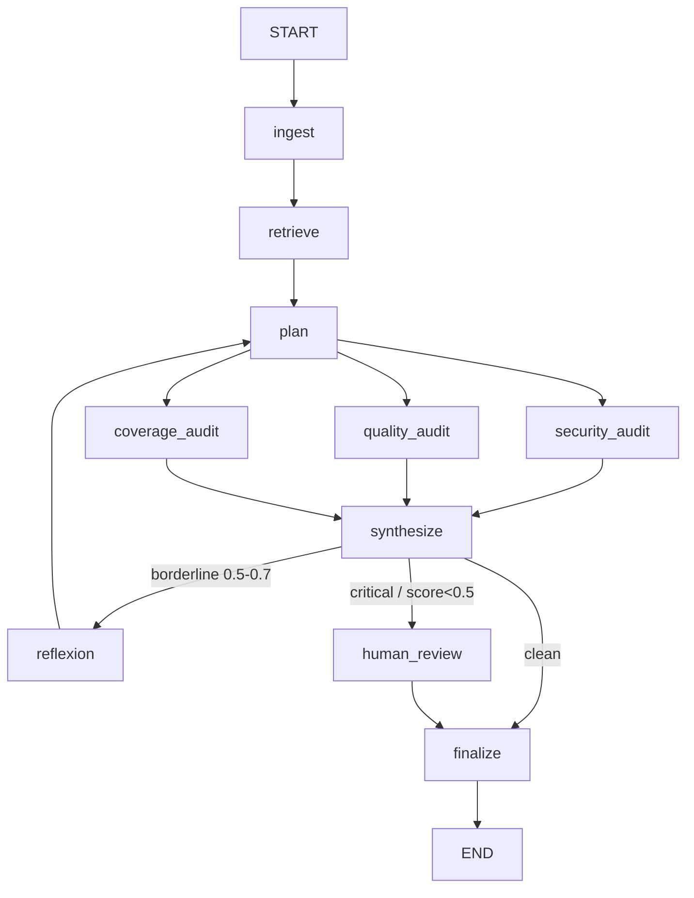

# LangGraph PR Audit Agent 🏦🔒

A multi-agent, stateful AI system that automates Pull Request security and quality audits. Framed for banking: every change touching payment logic, customer PII, or auth gets reviewed before merge.

## 📖 What is this project?
In a bank, a code change that touches auth or payment paths needs a security review before it merges. This agent does that review automatically.

It uses **LangGraph** to orchestrate a team of specialized agents over a GitHub PR diff, applying the **ReAct** (Reason + Act) pattern to check changes against OWASP Top 10, SQL injection, PII leaks, and authentication bypasses.

### Core Technologies:
- **LangGraph:** Stateful multi-agent orchestration and routing.
- **Gemini 2.5 Flash (audits) + Gemini 2.5 Pro (reflexion):** Core LLM reasoning engine (via `google-genai`).
- **Instructor:** Enforces strict structured JSON outputs (Pydantic V2 schemas).
- **Python 3.12+:** Core language.
- **pgvector (Postgres 16, Docker):** Backs the agent's persistent memory (HNSW, cosine > 0.7) - see [Agent Memory](#-agent-memory-four-types-one-system).
- **Gemini Embeddings (`gemini-embedding-001`, 768-dim):** Embeds diffs for retrieval.
- **LangSmith:** Tracing + custom output-quality evaluators.
- **Resilience layer (`src/llm_retry.py`):** Centralized retry / quota-aware backoff / API-key rotation across every Gemini call, with fail-closed semantics.

---

## 🏗️ Architecture



**Routing rules** (precedence: human review > reflect > finalize)
- `should_reflect`: **any** of the three scores (security/quality/test) in [0.5, 0.7], OR an auth-related file changed with zero **security** findings ("suspicious silence" - security-only heuristic). Capped at 2 loops (`iteration_count` guard).

- `needs_human_review`: any CRITICAL finding (any dimension), or **any** score < 0.5. Graph pauses here (`interrupt_before`).


### How the pipeline works
1. **Ingest** parses the raw diff into added/removed lines + a `files_changed` list.
2. **Retrieve** embeds the diff (`gemini-embedding-001`) and queries pgvector for similar past audits (cosine > 0.7), feeding precedent into the plan. Degrades gracefully if the DB is unavailable.
3. **Plan** (`gemini-2.5-flash`) triages the diff once - produces an `AuditPlan` (focus areas, risk level, audit depth). This is **Plan-Execute**: the three audits each receive a *targeted* brief instead of re-reading the whole diff cold.
4. **Three audits run in parallel** - security (OWASP/SQLi/PII/authn), quality (smells, magic numbers, DRY/SOLID), and coverage (missing tests). All are **plan-aware** (they read `audit_plan.focus_areas`).
5. **Synthesize** computes deterministic, severity-weighted scores ($0, no LLM) the router can act on.
6. **Reflexion** (`gemini-2.5-pro`) - on a borderline result, a *smarter* model critiques the audit, identifies gaps, and loops back to plan for a sharper second pass (max 2 loops).
7. **Human review / finalize** - on a CRITICAL finding or score < 0.5, the graph **pauses** at `human_review` (`interrupt_before`) for a human decision (see [Human-in-the-Loop](#-human-in-the-loop-pause--inject--resume)); otherwise it finalizes. `finalize` assembles the markdown report and persists it to pgvector as precedent.

### Reliability (banking-grade fail-closed)
Every Gemini call routes through `src/llm_retry.py`, which:
- Honours per-minute 429s (waits the server's `retryDelay`), and on per-day quota or a
  blocked key **rotates** `GEMINI_API_KEY → KEY2 → KEY3 → KEY4`.
- Raises `QuotaExhaustedError` only when **all** keys are unusable - the graph then aborts
  and emits **no report** rather than a misleading "all clear".
- If an audit node degrades (transient API error), it records to `node_errors`; `synthesize`
  forces all scores to `0.0` when an audit actually failed, so a transport failure can never
  masquerade as a clean PR. **A failure is never a false pass.**

---

## 🧠 Agent Memory (four types, one system)

The agent doesn't just react to the PR in front of it - it remembers. Memory is organised as four
types under one entry point, `AgentMemorySystem` (`src/memory.py`), borrowing the standard
cognitive split so each kind of memory has a clear job:

| Type | Holds | Where it lives | Retrieved by |
|------|-------|----------------|--------------|
| **In-context** | The live run's working state (diff, findings, scores) | `AuditState`, in the graph | direct read |
| **Semantic** | Similar past PR audits (precedent) | `pr_audits` (pgvector) | cosine similarity |
| **Episodic** | Compressed past-session summaries | `session_episodes` (pgvector) | cosine similarity |
| **Procedural** | Org audit rules / templates, keyed by category | `procedural_rules` (Postgres) | exact category lookup |

The persistent three share one embed + pgvector spine; procedural is a plain keyed table (a rule is
looked up by name, not by similarity, so it needs no embedding). Embeddings are memoised per process
(`vectorstore.embed`, bounded LRU) so the same diff embedded by more than one node in a run costs a
single API call.

**The state *is* the memory system.** The graph runs on a nested `AMSState`: an `audit` substate
(the in-context `AuditState`) plus `semantic` / `episodic` / `procedural` channels as siblings. The
catch with nesting: LangGraph's reducers only apply to top-level channels, so a custom `merge_audit`
reducer restores the per-field accumulation the audit substate needs - without it the parallel audit
fan-out (security/quality/coverage all write at once) would silently clobber each other's messages.

**All four types feed the audit, not just store data.** Memory is recalled once per run (in
`retrieve`) into the shared channels, then consumed where it's useful:

- **Semantic + episodic** precedent flows into the **plan** node, which uses "have we seen a change
  like this before?" to steer triage (focus areas, audit depth).
- **Procedural** rules are injected **verbatim** into each audit node's prompt, per domain - the
  security auditor sees the security rules, quality sees quality rules, coverage sees coverage rules
  - so a standing org rule is enforced to the letter, not just paraphrased into a focus area.

This closes the loop: retrieved context actually changes the audit, rather than being stored and
ignored.

### Rules have a lifecycle (and the agent can propose its own)

Procedural rules carry a `status` so the system can tell a trusted policy from an unvetted
suggestion:

| Status | Origin | Injected into audits? |
|--------|--------|------------------------|
| `seeded` | Human-authored baseline policy | Yes - active immediately |
| `learned_pending` | Proposed by the agent from its own findings | **No** - awaiting human review |
| `learned_approved` | A human approved a pending rule | Yes |

After an audit, the agent promotes its strongest findings (critical/high only, deduplicated) into
**proposed** rules - but they land as `learned_pending` and are **never enforced until a human
approves them**. This is deliberate: a rule derived from the agent's own output is a feedback loop,
and a single false positive would otherwise become a permanent rule injected into every future
audit. So the agent *proposes*; a human *approves*. Only `seeded` and `learned_approved` rules ever
reach a prompt.

---

## 📏 Context budgeting (`TokenBudgetManager`)

When you assemble a prompt from several pieces - a system prompt, the diff, retrieved precedent,
chat history - and the total can outgrow the model's window, you need to decide *what to drop* in
priority order rather than letting the call fail or truncate at a random byte. `TokenBudgetManager`
(`src/token_budget.py`) does that, and **logs every trim** so nothing is ever dropped silently.

It is generic by design: it imports nothing from this app (no `AuditState`, no DB). It operates on a
plain list of labelled, prioritised text `Segment`s and a budget, and returns the segments that fit
plus a trim log. The caller is what knows about your state - the manager just honours the priorities
you assign.

```python
from src.token_budget import TokenBudgetManager, Segment

# priority: lower number = higher priority. 0 = mandatory (never trimmed).
segments = [
    Segment(0, "system",     system_prompt),    # always kept
    Segment(1, "query",      user_diff),         # the current change
    Segment(2, "chunk:auth", retrieved_chunk),   # retrieved context, droppable
    Segment(3, "history:0",  old_message),       # oldest history, dropped first
]

kept, trim_log = TokenBudgetManager(budget_tokens=8000).fit(segments)

prompt = assemble(kept)          # build your prompt from what survived
for line in trim_log:            # never silent: surface what was dropped and why
    print(line)
```

**Priority convention:** `0` = system prompt (mandatory) · `1` = query / current diff · `2` =
retrieved chunks by relevance · `3+` = history. To trim **oldest history first**, give older
messages a higher priority number (e.g. `3 + age`) - the manager sorts by `(priority, input order)`,
so a naive all-equal priority would trim the *newest* first, which is the wrong end.

**Swapping the token counter:** the estimate is a dependency-free `len(text) // 4` heuristic - fine
for *deciding what to drop* (it doesn't need to be exact). The `counter` parameter lets you plug in a
real tokenizer when you want precision:

```python
TokenBudgetManager(budget_tokens=8000, counter=my_real_tokenizer)
```

### Plug-and-play: using it for very large (1M+ token) PR diffs

This repo does **not** route the live audit through the budget manager, and that is deliberate: a
single PR diff is far smaller than Gemini's ~1M-token window, so an in-band budget check here would
always keep everything, trim nothing, and only add latency. The class and its tests are the artifact;
it is demonstrated under synthetic oversized load in `tests/test_token_budget.py`.

If you are cloning this to handle genuinely huge diffs, the budget manager is the **last** mile, not
the whole fix. A diff larger than the model window breaks in three places, in this order:

1. **Embedding (breaks first).** `retrieve` and `finalize` embed the diff for similarity search and
   storage, and embedding models have a much smaller input limit than the chat window. You cannot fix
   this by trimming the text before embedding - a trimmed embedding represents a *different* text than
   the real diff, so similarity search returns wrong results. The fix is **chunked ingestion +
   retrieval** (split the diff per file/hunk, embed each chunk, retrieve the relevant ones).
2. **Parsing.** `parse_github_diff` (`src/nodes/ingest.py`) keeps every added/removed line, so a huge
   diff stays huge after parsing. You need a pre-reduction step (per-file summaries or changed-hunk
   headers).
3. **Prompt assembly (the budget manager's job).** Once the pieces are reasonably sized, route the
   prompt assembly in `plan.py` (and the audit nodes) through `TokenBudgetManager.fit(...)` instead of
   concatenating the diff and precedent directly, then set `budget_tokens` to your model's real window
   and (optionally) pass a real `counter`.

In short: handling a 1M+ diff is primarily a chunking/RAG problem (steps 1-2); the budget manager
cleanly handles the final fit (step 3) and is built to drop into that pipeline unchanged.

---

## 🚀 How to Install & Start

### 1. Clone & Environment Setup
```bash
# Clone the repository
git clone <your-repo-link>
cd langgraph-pr-audit-agent

# Create and activate a virtual environment (Windows)
python -m venv venv
venv\Scripts\activate
```

### 2. Install Dependencies
```bash
pip install -r requirements.txt
```

### 3. Environment Variables
Copy `.env.template` file to `.env` file in the root directory and add your API keys:
```bash
# bash and powershell
cp .env.template .env

# windows command prompt (cmd)
copy .env.template .env
```

### 4. Start the vector store (Docker)
The agent persists each audit to pgvector so future similar PRs can retrieve precedent.
```bash
docker compose up -d              # starts pgvector/pgvector:pg16 on $POSTGRES_PORT
python -m src.db.vectorstore      # create the tables + HNSW index (idempotent, safe to re-run)
python -m scripts.seed_rules      # load baseline org rules (idempotent; re-run adds only new ones)
```
`docker compose up -d` only starts an empty Postgres. The second command creates the
`vector` extension and the three tables the agent reads/writes. It is idempotent
(`CREATE TABLE IF NOT EXISTS`), so re-running it is harmless. The third loads the baseline
org rules the audit enforces - without it the procedural-rules table is empty and that check
is a no-op. It dedups, so editing the rule list and re-running only inserts what's new.

---

## 💥 In case you have to NUKE the schema
> **Destructive - read before running.** This permanently deletes all stored
> audits, session episodes, and rules. Only use it when you want a clean slate
> (e.g. after a schema change that `CREATE TABLE IF NOT EXISTS` can't apply to an
> existing table).
```bash
python -m src.db.vectorstore drop # drops all tables; prompts for 'yes' first
python -m src.db.vectorstore      # rebuild an empty schema with the latest columns
```
The `drop` command prints a red warning and waits for you to type `yes`;
anything else aborts and nothing is dropped. It removes only the tables (their
indexes go with them); the `vector` extension is left in place.

---

## 🧪 How to Test

### Run the Unit Tests (Pytest)
Unit tests run instantly and cost $0, asserting that your deterministic logic (like diff parsing) works perfectly.
```bash
# Run tests with verbose output
pytest -v

# Fast, $0 unit tests (mocked LLM) - excludes live integration tests
pytest -m "not integration" -v
```

### Run the E2E Smoke Test
The smoke test pushes a sample PR diff through the entire LangGraph state machine with a **live** Gemini call:
- **SQL-injection auth diff** → high-risk path: escalates and pauses at `human_review`.


```bash
# Run the full graph smoke tests
python main.py --test
```

---

## 🧑‍⚖️ Human-in-the-Loop (pause → inject → resume)

A high-risk PR shouldn't auto-merge on the model's say-so. The graph is compiled with
`interrupt_before=["human_review"]`, so when `synthesize` routes to `human_review`
(any **CRITICAL** finding, or any score **< 0.5**) the graph **pauses** before that node
and hands control to a human.

### Run the interactive audit
```bash
python main.py --demo
```

### How it works
1. **First pass** - the graph streams from `ingest` to `synthesize`. If clean, it goes
   straight to `finalize`. If high-risk, the stream **ends early**: the checkpointer
   (keyed on `thread_id`) freezes the run *before* `human_review`.
2. **Pause detected** - `app.get_state(config).next` contains `"human_review"`. The runner
   prints all three scores and lists every CRITICAL finding so the reviewer sees *why* it stopped.
3. **Inject** - the reviewer types `approve` / `reject` / `needs-changes`;
   `app.update_state(config, {"human_decision": decision})` writes it into the checkpoint.
4. **Resume** - `app.stream(None, config=config)` continues from the interrupt
   (`None` = "no new input, keep going"). The graph runs `human_review → finalize`, and the
   decision is stamped onto the final report.

> Because state is durable via the checkpointer, the pause can span a human coffee break
> (or a process restart) without losing the in-flight audit.

---

## 🔭 Observability & Tracing (LangSmith)

Every LLM call in the graph is traceable. LangSmith auto-instruments the run from environment
variables alone - no application code needed - so each audit produces a full node-by-node
trace (`ingest → retrieve → plan → security/quality/test audits → synthesize → reflexion`),
including the exact prompt, model, latency, token counts, and the Instructor-validated output
for every Gemini call.

Set these in your `.env`:
```bash
LANGCHAIN_TRACING_V2=true
LANGCHAIN_API_KEY=your_langchain_api_key_here
LANGCHAIN_PROJECT=langgraph-pr-audit-agent
LANGCHAIN_ENDPOINT=https://api.smith.langchain.com
```

Then run any audit and view the trace:
```bash
python main.py --test        # or --demo, or any real run
```
Open **https://smith.langchain.com** → project **`langgraph-pr-audit-agent`**. Each run is one
trace; drill into any node to see its prompt and structured output. This is what makes a
multi-step agent debuggable - when a score looks wrong you can see *which* node produced it and
*why*, instead of guessing from the final report.

> **Why LangSmith here, and not a second backend?** LangSmith covers both tracing *and* the
> output-quality evaluators below, so it earns its place. A self-hostable backend (Langfuse) is
> deferred to the dedicated LLMOps week, where the "zero data egress / regulated banking" story
> is built properly as its own self-hosted Docker stack - rather than bolting a redundant second
> tracer onto this repo.
>
> Tracing is **optional and additive**: with no `LANGCHAIN_*` vars set, the pipeline runs
> identically, just untraced.

## 📊 Output-Quality Evaluators (LangSmith)

Passing the smoke test proves the pipeline *ran*. `src/evaluators.py` adds custom LangSmith
evaluators that score whether the **output is trustworthy**:

- **`every_finding_has_cwe`** - traceability: every security finding must carry a `cwe_id`.
- **`score_consistent_with_findings`** - sanity: a high `security_score` alongside a CRITICAL
  finding is a contradiction and fails.

These run **offline, on demand** against a curated dataset - they are *not* part of a normal
audit run:
```bash
# Requires LANGCHAIN_API_KEY and a LangSmith dataset named "pr-audit-eval-set"
python -m src.evaluators
```

> This is the seed of a discipline that matures later into a CI **eval gate** (auto-run on
> any prompt/retrieval change, fail the build below a quality threshold).